# Docker Node.js Application on AWS with Docker

<p align="center">


</p>

---

# Dockerizing a Full-Stack Node.js Application on AWS

This project demonstrates how to containerize, deploy, and manage a full-stack **Node.js application** using **Docker** on an **Amazon EC2** instance while following containerization best practices.

Rather than simply running a Docker container, this repository documents the complete engineering workflow—from preparing the AWS environment and building Docker images to deploying multi-container services, troubleshooting issues, and verifying the application through the browser.

The goal of this project is to demonstrate practical Docker skills while producing professional-quality technical documentation suitable for a DevOps engineering portfolio.

---

> [!IMPORTANT]
> This repository is intended to showcase practical Docker, Linux, AWS, and containerization skills. Every major implementation step is documented with screenshots, command references, architecture diagrams, and engineering notes to make the deployment process reproducible.

---

# Table of Contents

- [Project Overview](#project-overview)
- [Project Objectives](#project-objectives)
- [Key Skills Demonstrated](#key-skills-demonstrated)
- [Technologies Used](#technologies-used)
- [Application Architecture](#application-architecture)
- [Architecture Diagram](#architecture-diagram)
- [Project Structure](#project-structure)
- [High-Level Workflow](#high-level-workflow)
- [Prerequisites](#prerequisites)
- [Environment Details](#environment-details)
- [Clone the Repository](#clone-the-repository)
- [Running the Application](#running-the-application)
- [Option 1 – Individual Docker Containers](#option-1--individual-docker-containers-custom-docker-network)
- [Option 2 – Docker Compose](#option-2--docker-compose)
- [Building the Docker Image](#building-a-standalone-docker-image-for-the-application)
- [Dockerfile Breakdown](#dockerfile-breakdown)
- [Docker Image Lifecycle](#docker-image-lifecycle)
- [Container Management](#managing-the-container-lifecycle)
- [Inspecting Container Logs](#inspecting-container-logs)
- [Accessing a Running Container](#accessing-the-running-container)
- [Common Docker Commands](#common-docker-commands)
- [Container Debugging Workflow](#container-debugging-workflow)
- [Docker Best Practices Applied](#docker-best-practices-applied)
- [Implementation Screenshots](#implementation-screenshots)
- [Challenges Encountered](#challenges-encountered)
- [Lessons Learned](#lessons-learned)
- [Future Improvements](#future-improvements)
- [Additional Documentation](#additional-documentation)
- [References](#references)
- [Project Summary](#project-summary)
- [Connect With Me](#connect-with-me)

---

# Project Overview

The application consists of four primary components working together inside a Docker-based environment:

- A responsive frontend built with HTML, CSS, and JavaScript
- A Node.js backend powered by Express
- A MongoDB database for persistent storage
- Mongo Express for browser-based database administration

The application can be deployed in two different ways:

- Running each service inside its own Docker container connected through a custom Docker network
- Running all services together using Docker Compose

Throughout the implementation, the following activities were completed:

- Installing Docker on Ubuntu
- Building a custom Docker image
- Running and managing Docker containers
- Creating Docker networks
- Connecting multiple containers
- Inspecting logs
- Debugging containers
- Verifying deployment through the browser
- Documenting the complete engineering workflow

---

> [!NOTE]
> Every major implementation step is accompanied by screenshots later in this document, making it easy to follow the deployment process from start to finish.

---

# Project Objectives

The primary objectives of this project were to:

- Understand Docker architecture and core components.
- Learn the difference between Docker images and containers.
- Create a production-ready Dockerfile.
- Build Docker images from application source code.
- Deploy applications inside Docker containers.
- Configure Docker networking.
- Connect multiple services using Docker Compose.
- Manage container lifecycles.
- Debug running containers.
- Verify deployments using browser-based testing.
- Develop a repeatable deployment workflow.
- Produce high-quality engineering documentation.

---

# Key Skills Demonstrated

This repository demonstrates practical experience with:

### Docker

- Docker Engine
- Docker Images
- Docker Containers
- Dockerfile
- Docker Build
- Docker Compose
- Docker CLI
- Docker Networking
- Image Tagging
- Port Mapping

### Cloud

- Amazon EC2
- Ubuntu Linux
- SSH
- Infrastructure Deployment

### Application Development

- Node.js
- Express
- MongoDB
- Mongo Express

### DevOps

- Container Lifecycle Management
- Infrastructure Documentation
- Linux Command Line
- Application Debugging
- Log Analysis
- Repeatable Deployments

---

# Technologies Used

| Technology | Purpose |
|------------|---------|
| Docker | Containerization Platform |
| Docker Compose | Multi-container orchestration |
| Dockerfile | Defines the application image |
| Docker CLI | Container management |
| Node.js | Backend runtime |
| Express | Web framework |
| MongoDB | Database |
| Mongo Express | Database administration |
| AWS EC2 | Cloud compute |
| Ubuntu Linux | Operating system |
| Git | Version control |
| GitHub | Repository hosting |
| HTML | Frontend |
| CSS | Frontend styling |
| JavaScript | Client-side functionality |

---

> [!TIP]
> If you're learning Docker, read this README from top to bottom. Each section builds upon the previous one, taking you from installing Docker to deploying a production-style multi-container application on AWS.

---

# Application Architecture

The application follows a multi-container architecture where each service is isolated inside its own Docker container while communicating over a shared Docker network.

The solution consists of four primary components:

- **Frontend** — HTML, CSS, and JavaScript user interface
- **Backend** — Node.js application powered by Express
- **Database** — MongoDB for persistent data storage
- **Database Administration** — Mongo Express for browser-based database management

Docker packages each component into isolated, portable containers, ensuring the application behaves consistently across development, testing, and production environments.

> [!IMPORTANT]
> Each container has its own filesystem, runtime environment, and dependencies. Containers communicate with one another through Docker networking instead of sharing the host operating system directly.

---

# Architecture Diagram

The diagram below illustrates the overall deployment architecture used throughout this project.

<p align="center">
    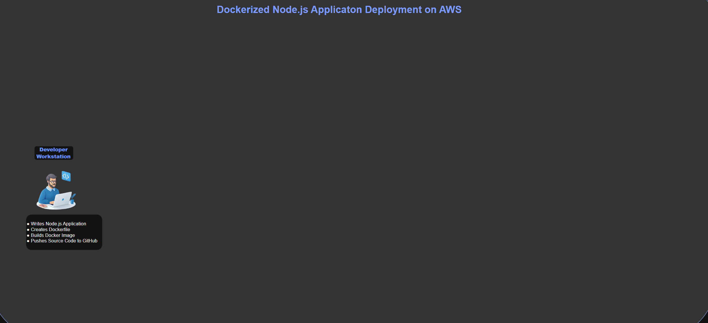
</p>

### Architecture Overview

The deployment workflow follows these stages:

1. The developer writes the Node.js application and Dockerfile.
2. The project is committed and pushed to GitHub.
3. An Ubuntu-based Amazon EC2 instance hosts the deployment environment.
4. Docker Engine builds a reusable image from the Dockerfile.
5. Docker creates one or more containers from that image.
6. MongoDB stores application data.
7. Mongo Express provides a web interface for database administration.
8. The Node.js application communicates with MongoDB through the Docker network.
9. Users access the application using the EC2 public IP address and exposed application port.

> [!NOTE]
> Docker networking allows containers to communicate using container names instead of IP addresses, making deployments more reliable and easier to manage.

---

# Application Components

| Component | Technology | Purpose |
|-----------|------------|---------|
| Frontend | HTML, CSS, JavaScript | Provides the user interface |
| Backend | Node.js + Express | Handles business logic and HTTP requests |
| Database | MongoDB | Stores application data |
| Database Administration | Mongo Express | Browser-based database management |
| Container Runtime | Docker Engine | Runs isolated application containers |
| Container Orchestration | Docker Compose | Starts and manages multiple services |

---

# Project Structure

The repository is organized to separate source code, documentation, architecture assets, screenshots, and supporting resources.

```text
Docker-nodejs-app/
│
├── app/
│   ├── images/
│   ├── index.html
│   ├── package.json
│   ├── package-lock.json
│   └── server.js
│
├── architecture/
│
├── docs/
│   ├── commands.md
│   ├── lessons-learned.md
│   ├── setup.md
│   ├── troubleshooting.md
│   └── video-script.md
│
├── images/
│   ├── architecture.gif
│   ├── browser-verification-of-the-application.png
│   ├── building-the-docker-image.png
│   ├── docker-installation-verification.png
│   ├── docker-installation-verification-details.png
│   ├── dockerfile-creation.png
│   ├── interactive-shell-access.png
│   ├── listing-docker-images.png
│   ├── listing-docker-images-2.png
│   ├── running-the-container.png
│   ├── running-container-verification.png
│   ├── verifying-running-containers.png
│   ├── verifying-running-container.png
│   ├── verifying-all-containers-running-and-stopped.png
│   ├── listing-stopped-containers.png
│   ├── stopping-the-container.png
│   └── starting-the-container.png
│
├── screenshots/
├── videos/
│
├── .gitignore
├── commands.md
├── Dockerfile
├── README.md
└── video-script.md
```

> [!TIP]
> Keeping screenshots, documentation, architecture diagrams, and source code in separate directories makes the repository easier to navigate and maintain as the project grows.

---

# Deployment Workflow

The deployment process follows a repeatable sequence from source code to a running application.

```text
Developer
      │
      ▼
Node.js Source Code
      │
      ▼
Dockerfile
      │
docker build
      │
      ▼
Docker Image
      │
docker run
      │
      ▼
Running Docker Container
      │
      ▼
Docker Network
      │
      ▼
MongoDB Container
      │
      ▼
Mongo Express Container
      │
      ▼
AWS EC2 Instance
      │
      ▼
Web Browser
```

### Workflow Summary

The deployment consists of the following stages:

1. Develop the application.
2. Write the Dockerfile.
3. Build the Docker image.
4. Create Docker containers.
5. Connect services through a Docker network.
6. Verify the running containers.
7. Test the application through the browser.
8. Inspect logs if issues occur.
9. Troubleshoot and redeploy when necessary.

---

> [!TIP]
> One of Docker's biggest advantages is reproducibility. Once an image has been built successfully, the same image can be deployed consistently across laptops, virtual machines, cloud instances, and production servers.

---

# Learning Outcomes

Completing this project provided practical experience with:

- Building Docker images from source code
- Writing production-ready Dockerfiles
- Creating and managing Docker containers
- Configuring Docker networking
- Deploying multi-container applications
- Using Docker Compose
- Debugging containerized workloads
- Inspecting logs
- Managing container lifecycles
- Deploying applications on AWS EC2
- Producing professional engineering documentation

> [!IMPORTANT]
> This project emphasizes understanding the complete container lifecycle—from development and image creation to deployment, troubleshooting, and operational management—rather than simply learning Docker commands.

---

# Prerequisites

Before running this project, ensure that your environment meets the following requirements.

| Requirement | Description |
|-------------|-------------|
| AWS Account | Used to provision the EC2 instance |
| Amazon EC2 | Ubuntu Linux virtual machine |
| Ubuntu Linux | Operating system used throughout this project |
| Docker Engine | Required to build and run containers |
| Docker Compose | Used for multi-container deployment |
| Git | Used to clone the repository |
| Node.js | Required to run the application locally |
| SSH Client | Used to connect to the EC2 instance |
| Web Browser | Used to access the deployed application |

> [!IMPORTANT]
> This project was implemented on an **Ubuntu-based Amazon EC2 instance** with Docker Engine installed. The same workflow can also be reproduced on any Linux machine with Docker installed.

---

# Environment Details

| Component | Value |
|-----------|-------|
| Cloud Provider | Amazon Web Services (AWS) |
| Compute Service | Amazon EC2 |
| Operating System | Ubuntu Linux |
| Container Runtime | Docker Engine |
| Container Orchestration | Docker Compose |
| Programming Language | JavaScript |
| Runtime | Node.js |
| Database | MongoDB |
| Database Administration | Mongo Express |
| Version Control | Git |
| Repository Hosting | GitHub |

---

# Clone the Repository

Clone the repository onto your local machine or your EC2 instance.

```bash
git clone https://github.com/Chukwuemeka-Peter-Eze/Docker-nodejs-app.git
```

Navigate into the project directory.

```bash
cd Docker-nodejs-app
```

> [!TIP]
> Always verify that you are inside the project directory before running any Docker commands.

---

# Running the Application

This project supports two deployment approaches:

1. Running each service individually using Docker networking.
2. Running the complete application using Docker Compose.

Both methods are documented below.

---

# Option 1 — Individual Docker Containers (Custom Docker Network)

## Step 1 — Create a Docker Network

Create a custom Docker network that allows containers to communicate with one another using container names.

```bash
docker network create mongo-network
```

> [!NOTE]
> Docker networks eliminate the need to manually manage container IP addresses.

---

## Step 2 — Start the MongoDB Container

```bash
docker run -d \
-p 27017:27017 \
-e MONGO_INITDB_ROOT_USERNAME=admin \
-e MONGO_INITDB_ROOT_PASSWORD=password \
--name mongodb \
--network mongo-network \
mongo
```

---

## Step 3 — Start Mongo Express

```bash
docker run -d \
-p 8081:8081 \
-e ME_CONFIG_MONGODB_ADMINUSERNAME=admin \
-e ME_CONFIG_MONGODB_ADMINPASSWORD=password \
-e ME_CONFIG_MONGODB_SERVER=mongodb \
--network mongo-network \
--name mongo-express \
mongo-express
```

---

## Step 4 — Verify Docker Images

Before starting the application, verify that Docker has successfully downloaded and created the required images.

```bash
docker images
```

The following screenshot shows the Docker images available after the build process.

<p align="center">

</p>

If multiple images have been created during development, your output may resemble the following.

<p align="center">
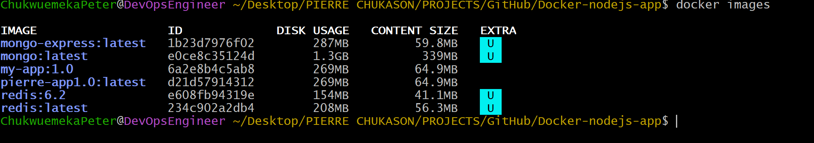
</p>

> [!TIP]
> The `docker images` command lists all locally available Docker images, including their repository names, tags, image IDs, creation times, and sizes.

---

## Step 5 — Build the Docker Image

Build the custom Docker image from the project's Dockerfile.

```bash
docker build -t docker-nodejs-app .
```

The following screenshot shows a successful image build.

<p align="center">
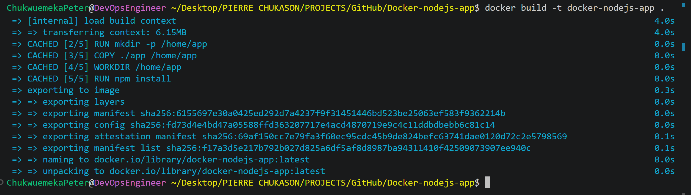
</p>

> [!IMPORTANT]
> A successful build confirms that Docker has processed the Dockerfile correctly and packaged the application into a reusable image.

---

## Step 6 — Start the Node.js Application Container

Create and start a container from the newly built Docker image.

```bash
docker run -d \
-p 3000:3000 \
--name nodejs-app \
docker-nodejs-app
```

The following screenshot shows the application container being started.

<p align="center">
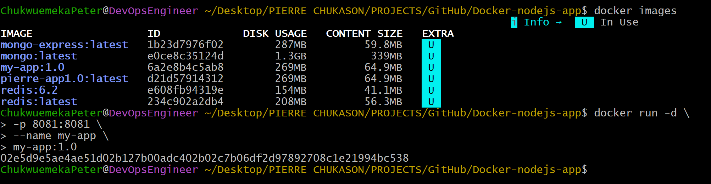
</p>

---

## Step 7 — Verify Running Containers

Check that the required containers are currently running.

```bash
docker ps
```

The following screenshot confirms that the containers are running successfully.

<p align="center">
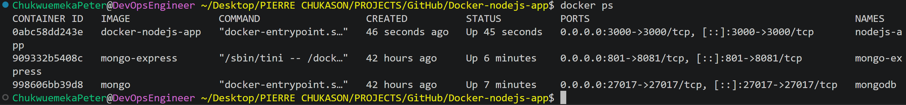
</p>

Additional verification can be performed using the following output.

<p align="center">
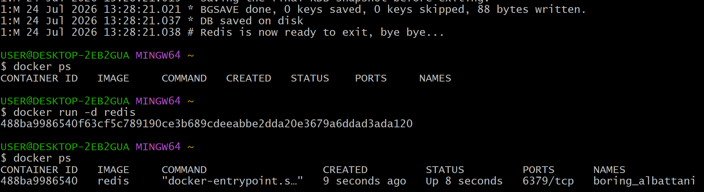
</p>

> [!NOTE]
> At this stage, MongoDB, Mongo Express, and the Node.js application should all be listed as running.

---

## Step 8 — Verify All Containers

To display both running and stopped containers, execute:

```bash
docker ps -a
```

The following screenshot shows all containers currently available on the system.

<p align="center">
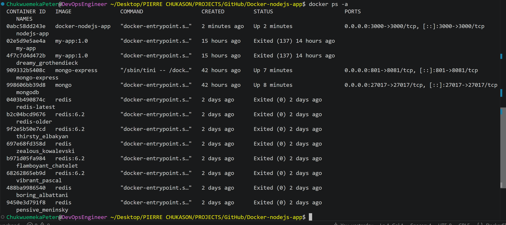
</p>

---

## Step 9 — Open Mongo Express

Access Mongo Express in your browser.

```text
http://localhost:8081
```

Create:

- Database: `user-account`
- Collection: `users`

---

## Step 10 — Start the Node.js Application

If you are running the application outside Docker:

```bash
cd app

npm install

node server.js
```

---

## Step 11 — Verify the Application

Open the application in your browser.

```text
http://localhost:3000
```

The following screenshot confirms that the application is running successfully.

<p align="center">

</p>

> [!IMPORTANT]
> Successfully loading the application in the browser confirms that the Docker image, Docker container, networking configuration, and Node.js application are all functioning correctly.

---

# Option 2 — Docker Compose

Docker Compose simplifies deployment by starting every required service with a single command.

Start all services:

```bash
docker compose up -d
```

> [!TIP]
> Modern versions of Docker use `docker compose` instead of the older `docker-compose` command.

Once all services have started:

- Open Mongo Express

```text
http://localhost:8081
```

- Create the database

```
user-account
```

- Create the collection

```
users
```

- Access the application

```text
http://localhost:3000
```

> [!NOTE]
> Docker Compose automatically creates the required network and connects all containers together, eliminating the need to create a custom Docker network manually.

---

# Building a Standalone Docker Image

In addition to running MongoDB and Mongo Express, the Node.js application itself can be packaged into a standalone Docker image.

Containerizing the application provides a consistent runtime environment, making deployments reproducible across development, testing, and production environments.

> [!IMPORTANT]
> A Docker image is an immutable blueprint used to create one or more running containers. Every container created from the image starts with the same application code, dependencies, and runtime configuration.

---

# Dockerfile Breakdown

The project includes a Dockerfile that defines how Docker packages the application.

The build process consists of the following stages:

```text
Dockerfile
      │
      ▼
Read Instructions
      │
      ▼
Download Base Image
      │
      ▼
Copy Application Files
      │
      ▼
Install Dependencies
      │
      ▼
Expose Application Port
      │
      ▼
Define Startup Command
      │
      ▼
Create Docker Image
```

The Dockerfile performs the following tasks:

- Selects an official Node.js base image.
- Creates the application working directory.
- Copies project files into the image.
- Installs application dependencies.
- Exposes port **3000**.
- Defines the startup command.

> [!NOTE]
> Docker builds images in layers. If a layer has not changed since the previous build, Docker reuses the cached layer, significantly reducing build time.

---

# Build the Docker Image

Build the application image using:

```bash
docker build -t docker-nodejs-app .
```

Docker performs the following operations:

1. Reads the Dockerfile.
2. Downloads the required base image.
3. Copies application files.
4. Installs project dependencies.
5. Creates reusable image layers.
6. Produces the final Docker image.

The screenshot below shows a successful image build.

<p align="center">

</p>

---

# Verify Docker Images

Verify that the image has been created successfully.

```bash
docker images
```

The output should include:

- Repository
- Tag
- Image ID
- Creation Date
- Image Size

<p align="center">

</p>

If multiple images exist, your output may resemble:

<p align="center">

</p>

> [!TIP]
> Before rebuilding an image, use `docker images` to confirm whether the image already exists locally.

---

# Run the Docker Container

Create and start a container from the image.

```bash
docker run -d \
-p 3000:3000 \
--name nodejs-app \
docker-nodejs-app
```

Explanation:

| Option | Description |
|---------|-------------|
| `-d` | Run container in detached mode |
| `-p` | Publish container port |
| `--name` | Assign container name |
| Image Name | Docker image used to create the container |

The screenshot below shows the container being started successfully.

<p align="center">

</p>

---

# Verify Running Containers

Display running containers.

```bash
docker ps
```

<p align="center">

</p>

Additional verification:

<p align="center">

</p>

> [!NOTE]
> If the application container does not appear, inspect its logs using `docker logs`.

---

# Docker Image Lifecycle

Understanding the lifecycle of a Docker image is fundamental to working with containers.

```text
Application Source Code
          │
          ▼
      Dockerfile
          │
          ▼
    docker build
          │
          ▼
     Docker Image
          │
          ▼
      docker run
          │
          ▼
 Running Container
          │
          ▼
 docker stop/start
          │
          ▼
 docker rm (optional)
```

> [!TIP]
> Images are templates. Containers are running instances of those templates.

---

# Inspecting Container Logs

Container logs are the first place to investigate when an application behaves unexpectedly.

Display logs:

```bash
docker logs nodejs-app
```

Logs commonly reveal:

- Startup messages
- Runtime errors
- Missing packages
- Connection failures
- Unexpected exceptions

> [!IMPORTANT]
> Reviewing logs should always be your first troubleshooting step before rebuilding or redeploying a container.

---

# Accessing the Running Container

Open an interactive shell inside the container.

```bash
docker exec -it nodejs-app sh
```

This allows you to:

- Inspect files
- Verify dependencies
- Explore directories
- Check configuration
- Execute diagnostic commands

The screenshot below demonstrates interactive shell access.

<p align="center">
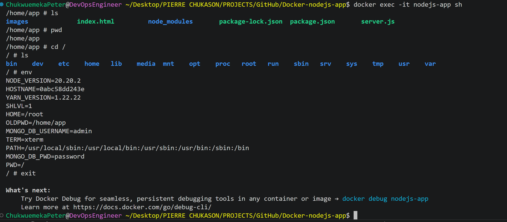
</p>

---

# Managing the Container Lifecycle

Docker containers can be stopped, started, restarted, and removed without rebuilding the image.

## Stop a Container

```bash
docker stop nodejs-app
```

The following screenshot shows the container being stopped.

<p align="center">
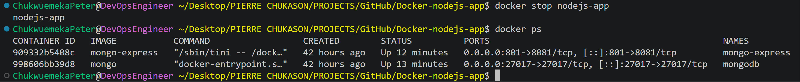
</p>

---

## Start a Container

```bash
docker start nodejs-app
```

<p align="center">
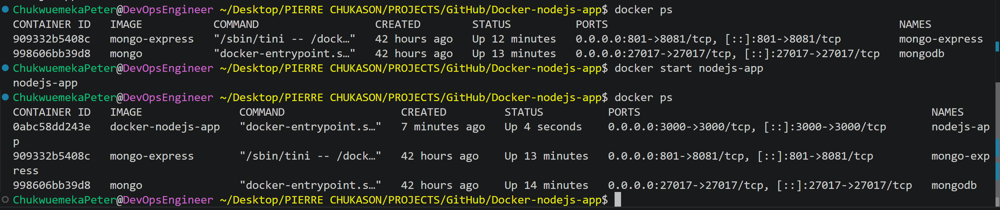
</p>

---

## Restart a Container

```bash
docker restart nodejs-app
```

Restarting stops and immediately starts the container.

---

## List Running Containers

```bash
docker ps
```

---

## List All Containers

```bash
docker ps -a
```

The following screenshot displays every container on the system.

<p align="center">

</p>

---

## List Stopped Containers

```bash
docker ps -f "status=exited"
```

The screenshot below displays stopped containers.

<p align="center">
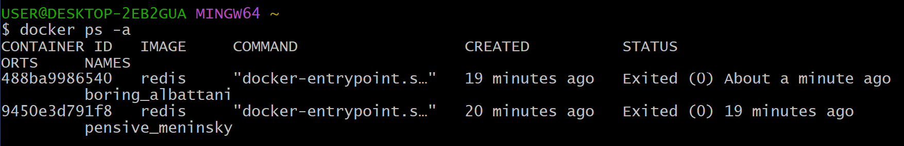
</p>

---

## Remove a Container

```bash
docker rm nodejs-app
```

Removes the container while preserving the Docker image.

---

## Remove the Docker Image

```bash
docker rmi docker-nodejs-app
```

Deletes the image from the local machine.

> [!WARNING]
> An image cannot be removed while containers created from it still exist. Remove the containers first or use the `-f` option if appropriate.

---

# Common Docker Commands

| Command | Purpose |
|---------|---------|
| `docker build` | Build an image |
| `docker run` | Create and start a container |
| `docker images` | List images |
| `docker ps` | Show running containers |
| `docker ps -a` | Show all containers |
| `docker logs` | View logs |
| `docker exec -it` | Access a running container |
| `docker stop` | Stop a container |
| `docker start` | Start a stopped container |
| `docker restart` | Restart a container |
| `docker rm` | Remove a container |
| `docker rmi` | Remove an image |
| `docker compose up -d` | Start all services |

---

# Container Debugging Workflow

```text
Application Not Responding
          │
          ▼
Check Running Containers
      docker ps
          │
          ▼
Inspect Logs
    docker logs
          │
          ▼
Access Container
 docker exec -it
          │
          ▼
Verify Configuration
          │
          ▼
Identify Root Cause
          │
          ▼
Apply Fix
          │
          ▼
Rebuild Image
          │
          ▼
Redeploy Container
```

> [!TIP]
> Following a consistent debugging workflow reduces downtime, speeds up troubleshooting, and makes production incidents much easier to resolve.

---

# Docker Best Practices Applied

Throughout this project, several Docker best practices were followed to improve consistency, maintainability, and deployment reliability.

## Image Management

- Built a custom Docker image using a dedicated Dockerfile.
- Used an official Node.js base image.
- Packaged application code and dependencies together.
- Built reusable images that can be deployed consistently across environments.

---

## Container Management

- Assigned meaningful names to containers.
- Used detached mode (`-d`) for background execution.
- Published only the required ports.
- Verified running containers after deployment.
- Managed the complete container lifecycle using Docker CLI.

---

## Networking

- Created a custom Docker network.
- Enabled service-to-service communication using container names.
- Isolated application services from the host environment.

---

## Operations

- Used Docker logs for troubleshooting.
- Accessed running containers using an interactive shell.
- Verified application health after deployment.
- Documented deployment commands for repeatability.

---

## Documentation

- Documented every implementation step.
- Included architecture diagrams.
- Added screenshots for major deployment milestones.
- Created reusable command references.
- Recorded lessons learned and troubleshooting procedures.

> [!TIP]
> Good DevOps practices extend beyond writing commands. Clear documentation, reproducible deployments, and operational troubleshooting are equally important engineering skills.

---

# Implementation Screenshots

Every major implementation step shown in this repository is supported with screenshots.

The screenshots demonstrate:

- Docker installation verification
- Dockerfile creation
- Docker image creation
- Docker image verification
- Container deployment
- Container verification
- Browser verification
- Interactive shell access
- Container lifecycle management

> [!NOTE]
> Instead of placing all screenshots in one gallery, each image is positioned directly after the command or step it documents. This provides a smoother reading experience and makes the implementation easier to follow.

---

# Challenges Encountered

Every engineering project involves troubleshooting. During this implementation, several issues were encountered and resolved.

## Docker Image Build Errors

### Possible Causes

- Missing project files
- Incorrect Dockerfile instructions
- Dependency installation failures

### Resolution

- Reviewed Docker build output.
- Corrected Dockerfile configuration.
- Rebuilt the image.

---

## Container Failed to Start

### Possible Causes

- Incorrect startup command
- Missing dependencies
- Incorrect working directory

### Resolution

- Reviewed the Dockerfile.
- Inspected container logs.
- Verified installed packages.
- Rebuilt the Docker image.

---

## Port Already in Use

### Possible Causes

- Another application was already using the selected port.

### Resolution

- Identified the conflicting process.
- Stopped the existing service.
- Selected an alternative host port where necessary.

---

## Application Not Accessible

### Possible Causes

- Incorrect port mapping
- Container not running
- Application not listening on the expected port
- AWS security group configuration

### Resolution

- Verified running containers.
- Confirmed port mappings.
- Checked EC2 security group rules.
- Tested browser connectivity.

> [!IMPORTANT]
> Most container deployment issues can be diagnosed by following a consistent workflow:
>
> 1. Verify the container is running.
> 2. Inspect the logs.
> 3. Access the container.
> 4. Confirm networking.
> 5. Rebuild if necessary.

---

# Lessons Learned

This project reinforced several key concepts in containerization and cloud engineering.

## Docker

- Docker images are immutable deployment artifacts.
- Containers are isolated runtime instances of images.
- Dockerfiles enable repeatable deployments.
- Image layers improve build performance.

---

## Networking

- Docker networks simplify communication between services.
- Containers can communicate using container names instead of IP addresses.
- Port publishing controls external access.

---

## Deployment

- Containerization eliminates environment inconsistencies.
- Docker Compose simplifies multi-container deployments.
- Infrastructure becomes easier to reproduce.

---

## Operations

- Logs are the primary troubleshooting tool.
- Interactive container access simplifies debugging.
- Verifying deployments is just as important as deploying them.

---

## Documentation

One of the most valuable lessons from this project was the importance of documentation.

Engineering documentation should:

- Explain the implementation.
- Capture troubleshooting steps.
- Be reproducible.
- Help future engineers understand the deployment.

> [!TIP]
> Well-written documentation is a force multiplier. It reduces onboarding time, simplifies troubleshooting, and improves collaboration across engineering teams.

---

# Future Improvements

Potential enhancements for this project include:

- Multi-stage Docker builds
- Non-root containers
- Docker health checks
- Environment variable management
- Docker secrets
- Automated image scanning
- CI/CD pipeline integration
- GitHub Actions automation
- Private container registry
- Kubernetes deployment
- Infrastructure as Code (Terraform)
- Monitoring with Prometheus and Grafana
- Centralized logging
- Automated testing during image builds

These improvements align with production-grade DevOps practices and provide a natural progression toward Kubernetes-based deployments.

---

# Additional Documentation

This repository includes supplementary documentation for readers who want to explore the implementation in greater detail.

| Document | Description |
|----------|-------------|
| `docs/setup.md` | Environment setup guide |
| `docs/commands.md` | Extended Docker command reference |
| `docs/troubleshooting.md` | Troubleshooting guide |
| `docs/lessons-learned.md` | Detailed lessons learned |
| `docs/video-script.md` | Project walkthrough script |
| `docker_commands.md` | Quick Docker command cheat sheet |

---

# References

The following resources were used throughout the implementation:

- Docker Official Documentation
- Docker CLI Documentation
- Docker Compose Documentation
- Dockerfile Best Practices
- Node.js Documentation
- MongoDB Documentation
- Mongo Express Documentation
- AWS EC2 Documentation
- Ubuntu Documentation

---

# Project Summary

This project demonstrates the complete process of deploying a full-stack Node.js application using Docker on Amazon EC2.

The implementation included:

- Installing Docker
- Building custom Docker images
- Running standalone containers
- Creating Docker networks
- Deploying multiple services with Docker Compose
- Managing container lifecycles
- Inspecting logs
- Troubleshooting deployments
- Verifying application functionality
- Producing professional engineering documentation

More importantly, this project demonstrates the engineering mindset required for modern DevOps work:

- Building reproducible systems
- Automating deployments
- Understanding container lifecycles
- Troubleshooting operational issues
- Documenting infrastructure effectively

---

# Connect With Me

If you found this project helpful or would like to discuss Docker, DevOps, Cloud Engineering, or Infrastructure Automation, feel free to connect.

- **GitHub:** https://github.com/Chukwuemeka-Peter-Eze
- **LinkedIn:** https://www.linkedin.com/in/chukwuemekapetereze/
- **Notion:** https://lumpy-bubble-7b0.notion.site/Containers-with-Docker-3a546a96f97480a88041ff2ff82a6b5f?source=copy_link

---

<p align="center">

**⭐ If you found this project helpful, consider starring the repository.**

**Thank you for taking the time to explore this project!**

</p>
