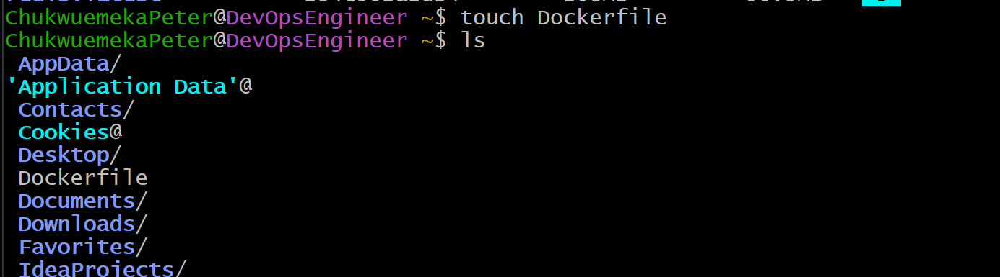
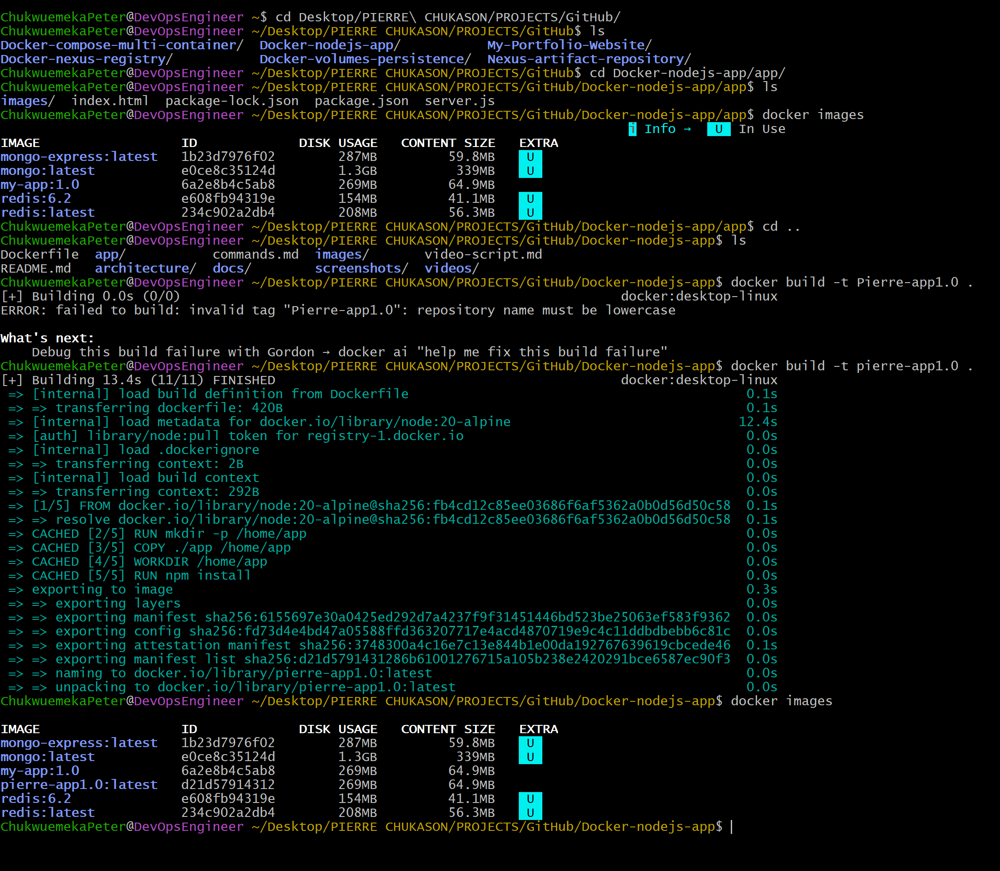
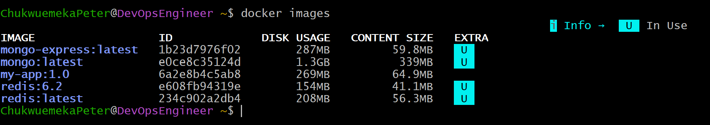
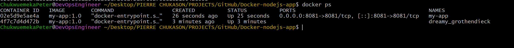
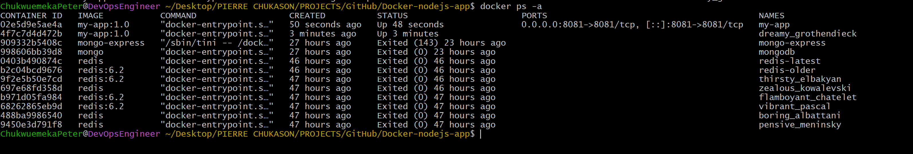

# Docker Node.js Application on AWS with Docker

<p align="center">


</p>

# Project Overview

This project demonstrates how to containerize and run a full-stack Node.js application using Docker while following containerization best practices.

The application consists of three primary components:

- A frontend built with HTML, JavaScript, and CSS
- A Node.js backend powered by Express
- A MongoDB database for persistent data storage

The project also includes Mongo Express, a web-based MongoDB administration interface, allowing easy database management during development.

The application can be deployed in two ways:

- **Individual Docker containers** connected through a custom Docker network
- **Multi-container deployment** using Docker Compose

In addition to running the application, this repository documents the complete implementation process, Docker commands, architecture diagrams, troubleshooting steps, lessons learned, screenshots, and deployment workflow.

---

# Project Objectives

The main objectives of this project were to:

- Understand Docker's architecture and core components.
- Learn the difference between Docker images and containers.
- Create a production-ready Dockerfile for a Node.js application.
- Build custom Docker images using Docker Build.
- Run containerized applications with Docker, both individually and via Docker Compose.
- Connect multiple containers together using a custom Docker network.
- Expose applications through port mapping.
- Inspect running containers.
- Debug containers using Docker logs and interactive shell sessions.
- Stop, restart, and remove containers.
- Develop a repeatable deployment workflow using Docker.
- Document the complete implementation process for future reference.

---

# Application Architecture

The application consists of four major components:

```text
Browser
      │
      ▼
Node.js Application (Express)
      │
      ▼
MongoDB Database
      ▲
      │
Mongo Express
```

## Components

### Frontend
- HTML
- JavaScript
- CSS

### Backend
- Node.js
- Express

### Database
- MongoDB

### Database Administration
- Mongo Express

Docker is used to package each service into isolated containers, ensuring consistency across different environments.

---

# Project Structure

```text
Docker-nodejs-app/
│
├── app/                     # Node.js application source code
│   ├── images/
│   ├── index.html
│   ├── package.json
│   ├── package-lock.json
│   └── server.js
│
├── architecture/            # Architecture diagram source files
├── docs/                    # Supporting documentation
│   ├── commands.md
│   ├── lessons-learned.md
│   ├── setup.md
│   ├── troubleshooting.md
│   └── video-script.md
│
├── images/                  # Architecture diagram assets
│   └── architecture.gif
│
├── screenshots/             # Screenshots of the implementation process
├── videos/                  # Supporting video assets
│
├── .gitignore
├── docker_commands.md       # Quick-reference Docker command cheat sheet
├── docker-compose.yaml
├── Dockerfile
└── README.md
```

---

# Key Skills Demonstrated

This project demonstrates practical experience with:

- Docker Installation
- Docker Engine
- Docker Images
- Docker Containers
- Docker Networks
- Dockerfile
- Docker Build
- Docker Run
- Docker Compose
- Docker CLI
- Container Lifecycle Management
- Image Tagging
- Port Mapping
- Docker Logs
- Docker Exec
- Container Debugging
- Linux Command Line
- AWS EC2
- Node.js Deployment
- Application Containerization
- Infrastructure Documentation

---

# Technologies Used

| Technology | Purpose |
|------------|---------|
| Node.js | Backend Application |
| Express | Backend Web Framework |
| MongoDB | Database / Persistent Storage |
| Mongo Express | Web-based MongoDB Administration |
| Docker | Containerization Platform |
| Docker Compose | Multi-Container Orchestration |
| Docker CLI | Container Management |
| Dockerfile | Image Definition |
| AWS EC2 | Cloud Compute Environment |
| Ubuntu Linux | Operating System |
| Git | Version Control |
| GitHub | Source Code Repository |

---

# Architecture Diagram

The following diagram illustrates the complete deployment workflow.

<p align="center">
  
</p>

## Architecture Overview

The architecture illustrates the complete deployment lifecycle of the Dockerized Node.js application on AWS.

1. The developer creates the Node.js application, writes the Dockerfile, and pushes the source code to GitHub.
2. An Amazon EC2 instance running Ubuntu Linux serves as the deployment environment.
3. The project repository is cloned from GitHub onto the EC2 instance.
4. Docker Engine builds a reusable Docker image from the application's Dockerfile.
5. A Docker container is created and started from the image using the `docker run` command (or all services are started together with `docker-compose up`).
6. The Node.js application runs inside an isolated container and communicates with MongoDB and Mongo Express over a Docker network, listening on port **3000**.
7. End users access the application through a web browser using the EC2 instance's public IP address and the published port.

This architecture demonstrates how Docker enables consistent application packaging and deployment while leveraging AWS EC2 as the underlying compute infrastructure.

---

# High-Level Workflow

```text
Developer
     │
     ▼
Node.js Source Code
     │
     ▼
Dockerfile
     │
docker build
     │
     ▼
Docker Image
     │
docker run  /  docker-compose up
     │
     ▼
Running Docker Container(s)
     │
Port Mapping
     │
     ▼
AWS EC2 Instance
     │
     ▼
Web Browser
```

---

# Learning Outcomes

By completing this project, I gained practical experience in:

- Building Docker images from source code.
- Writing and understanding Dockerfiles.
- Packaging applications into portable containers.
- Running applications in isolated environments.
- Connecting multiple containers using custom Docker networks.
- Orchestrating multi-container applications with Docker Compose.
- Managing Docker containers through the command line.
- Inspecting application logs.
- Troubleshooting running containers.
- Understanding Docker's image-to-container workflow.
- Deploying containerized applications on AWS infrastructure.
- Documenting engineering work using GitHub as a professional portfolio.

---

# Prerequisites

Before getting started, ensure the following tools and services are available in your environment.

| Requirement | Description |
|-------------|-------------|
| AWS Account | Used to provision the EC2 instance for hosting the application |
| Amazon EC2 Instance | Linux virtual machine where Docker was installed |
| Ubuntu Linux | Operating system used during implementation |
| Docker Engine | Container runtime used to build and run containers |
| Docker Compose | Used for multi-container orchestration |
| Git | Used to clone the project repository |
| Node.js Application | Sample application used for containerization |
| Terminal Access | SSH connection to the EC2 instance |
| Web Browser | Used to verify the deployed application |

---

# Environment Details

| Component | Value |
|-----------|-------|
| Cloud Provider | Amazon Web Services (AWS) |
| Compute Service | Amazon EC2 |
| Operating System | Ubuntu Linux |
| Container Runtime | Docker Engine |
| Programming Language | JavaScript |
| Runtime | Node.js |
| Version Control | Git |
| Repository Hosting | GitHub |

---

# Clone the Repository

Clone the repository to your local machine or EC2 instance.

```bash
git clone https://github.com/Chukwuemeka-Peter-Eze/Docker-nodejs-app.git
```

Navigate into the project directory.

```bash
cd Docker-nodejs-app
```

---

# Running the Application

This application can be run in two ways: by starting each container individually and connecting them over a custom Docker network, or by using Docker Compose to bring up all services at once. Both approaches are documented below.

## Option 1 — Individual Docker Containers (Custom Docker Network)

**Step 1: Create a Docker network**

```bash
docker network create mongo-network
```

**Step 2: Start MongoDB**

```bash
docker run -d -p 27017:27017 \
  -e MONGO_INITDB_ROOT_USERNAME=admin \
  -e MONGO_INITDB_ROOT_PASSWORD=password \
  --name mongodb \
  --net mongo-network \
  mongo
```

**Step 3: Start Mongo Express**

```bash
docker run -d -p 8081:8081 \
  -e ME_CONFIG_MONGODB_ADMINUSERNAME=admin \
  -e ME_CONFIG_MONGODB_ADMINPASSWORD=password \
  -e ME_CONFIG_MONGODB_SERVER=mongodb \
  -e ME_CONFIG_MONGODB_URL=mongodb://mongodb:27017 \
  --net mongo-network \
  --name mongo-express \
  mongo-express
```

> **Note:** Creating a Docker network is optional. Both containers can be started on the default network by simply omitting the `--net` flag from the `docker run` commands.

**Step 4: Open Mongo Express in your browser**

```text
http://localhost:8081
```

**Step 5: Create the database and collection**

In the Mongo Express UI, create a `user-account` database and a `users` collection.

**Step 6: Start the Node.js application locally**

```bash
cd app
npm install
node server.js
```

**Step 7: Access the Node.js application**

```text
http://localhost:3000
```

## Option 2 — Docker Compose

**Step 1: Start MongoDB and Mongo Express**

```bash
docker-compose -f docker-compose.yaml up
```

**Step 2: Open Mongo Express in your browser**

```text
http://localhost:8081
```

**Step 3: Create the database and collection**

In the Mongo Express UI, create a `user-account` database, then create a `users` collection inside it.

**Step 4: Start the Node.js application**

```bash
cd app
npm install
node server.js
```

**Step 5: Access the Node.js application**

```text
http://localhost:3000
```

---

# Building a Standalone Docker Image for the Application

In addition to running the supporting services (MongoDB, Mongo Express), the Node.js application itself can be packaged into its own Docker image using the project's Dockerfile.

## Dockerfile Overview

The Dockerfile defines how Docker should package the Node.js application into a reusable image. The implementation includes:

- Selecting an appropriate Node.js base image
- Setting the working directory
- Copying project files
- Installing dependencies
- Exposing the application port
- Defining the startup command

This process ensures that every container created from the image starts with the same runtime environment and application configuration.

## Build the Docker Image

```bash
docker build -t docker-nodejs-app .
```

The dot (`.`) at the end of the command denotes the location of the Dockerfile (the current directory).

Docker performs the following operations:

1. Reads the Dockerfile.
2. Downloads the required base image (if not already available).
3. Copies the application source code.
4. Installs dependencies.
5. Creates image layers.
6. Produces a reusable Docker image.

## Verify the Docker Image

```bash
docker images
```

Expected outcome:

- Repository name
- Image tag
- Image ID
- Creation time
- Image size

## Run the Docker Container

```bash
docker run -d \
-p 3000:3000 \
--name nodejs-app \
docker-nodejs-app
```

Explanation:

- `-d` runs the container in detached mode.
- `-p` maps the host port to the container port.
- `--name` assigns a readable container name.
- The final argument specifies the image used to create the container.

## Verify Running Containers

```bash
docker ps
```

Typical information displayed includes:

- Container ID
- Image
- Command
- Status
- Port mappings
- Container name

## Access the Application

Once the container is running, access the application through a web browser using your EC2 instance's public IP address and the mapped application port:

```text
http://<EC2-Public-IP>:3000
```

If the application loads successfully, it confirms that:

- The Docker image was built correctly.
- The container is running.
- Port mapping is configured correctly.
- The application is listening on the expected port.
- Network connectivity is functioning as intended.

---

# Implementation Summary

By this stage of the project, the following milestones have been completed:

- Docker environment prepared on AWS EC2
- Project source code cloned
- Dockerfile reviewed
- Custom Docker network created and supporting services (MongoDB, Mongo Express) connected
- Custom Docker image successfully built
- Docker image verified
- Application container launched (individually and via Docker Compose)
- Running container verified
- Web application successfully accessed through the browser

These steps establish a repeatable workflow for packaging and deploying Node.js applications using Docker.

---

# Dockerfile Breakdown

The Dockerfile is the blueprint that defines how Docker should build a container image for the Node.js application. Instead of manually installing dependencies and configuring the runtime environment every time, Docker executes each instruction in the Dockerfile to produce a consistent and reusable image.

A simplified Docker build process follows these stages:

```text
Dockerfile
     │
     ▼
Read Instructions
     │
     ▼
Pull Base Image
     │
     ▼
Copy Application Files
     │
     ▼
Install Dependencies
     │
     ▼
Expose Application Port
     │
     ▼
Configure Startup Command
     │
     ▼
Create Docker Image
```

Each instruction creates a new image layer, allowing Docker to cache unchanged layers and significantly reduce rebuild times.

---

# Docker Image Lifecycle

```text
Application Source Code
            │
            ▼
        Dockerfile
            │
            ▼
      docker build
            │
            ▼
      Docker Image
            │
            ▼
       docker run
            │
            ▼
    Running Container
            │
            ▼
 docker stop / restart
            │
            ▼
 docker rm (optional)
```

Understanding this lifecycle helps distinguish between an image (a reusable template) and a container (a running instance of that image).

---

# Inspecting Container Logs

```bash
docker logs nodejs-app
```

Logs can help identify:

- Application startup messages
- Runtime errors
- Missing dependencies
- Server initialization
- Unexpected exceptions

Reviewing logs is often the first step when a container does not behave as expected.

---

# Accessing the Running Container

```bash
docker exec -it nodejs-app sh
```

Using an interactive shell makes it possible to:

- Inspect application files
- Verify installed packages
- Explore the container filesystem
- Run diagnostic commands
- Validate environment configuration

---

# Managing the Container Lifecycle

## Stop a Running Container

```bash
docker stop nodejs-app
```

Gracefully stops the application and releases allocated resources.

## Start an Existing Container

```bash
docker start nodejs-app
```

Starts a previously stopped container without rebuilding the image.

## Restart a Container

```bash
docker restart nodejs-app
```

Stops and immediately starts the container again.

## Remove a Container

```bash
docker rm nodejs-app
```

Deletes the container while leaving the underlying Docker image intact.

## Remove a Docker Image

```bash
docker rmi docker-nodejs-app
```

Deletes the locally stored image when it is no longer required.

---

# Common Docker Commands

| Command | Purpose |
|----------|---------|
| `docker network create` | Create a custom Docker network |
| `docker build` | Build a Docker image from a Dockerfile |
| `docker images` | List available Docker images |
| `docker run` | Create and start a container |
| `docker-compose up` | Start all services defined in a compose file |
| `docker ps` | Display running containers |
| `docker ps -a` | Display all containers |
| `docker logs` | View container logs |
| `docker exec -it` | Open an interactive shell inside a running container |
| `docker stop` | Stop a running container |
| `docker start` | Start a stopped container |
| `docker restart` | Restart a container |
| `docker rm` | Remove a container |
| `docker rmi` | Remove a Docker image |

For a full quick-reference cheat sheet, see [`docker_commands.md`](docker_commands.md).

---

# Container Debugging Workflow

```text
Application Not Responding
            │
            ▼
Check Running Containers
(docker ps)
            │
            ▼
Inspect Logs
(docker logs)
            │
            ▼
Access Container
(docker exec -it)
            │
            ▼
Verify Application Process
            │
            ▼
Identify Root Cause
            │
            ▼
Apply Fix
            │
            ▼
Rebuild Image
            │
            ▼
Redeploy Container
```

Following a consistent debugging workflow helps reduce troubleshooting time and improves operational reliability. See [`docs/troubleshooting.md`](docs/troubleshooting.md) for more detail.

---

# Docker Best Practices Applied

- Built the application using a dedicated Dockerfile.
- Used Docker images to package application code and dependencies together.
- Assigned meaningful names to images, containers, and networks.
- Used a custom Docker network to enable service-to-service communication.
- Verified image creation before deployment.
- Used detached mode to run containers in the background.
- Published application ports explicitly.
- Verified container status after startup.
- Used Docker logs for troubleshooting.
- Accessed running containers for inspection using an interactive shell.
- Used Docker Compose for a repeatable, single-command multi-container setup.
- Maintained a repeatable workflow that can be executed consistently across environments.

---

# Implementation Screenshots

The following screenshots document each stage of the Docker implementation process.

---

## 1. Docker Installation Verification

<p align="center">
  
</p>

---

## 2. Detailed Docker Installation Information

<p align="center">
  
</p>

---

## 3. Dockerfile Creation

<p align="center">
  
</p>

---

## 4. Building the Docker Image

<p align="center">
  
</p>

---

## 5. Listing Docker Images

<p align="center">
  
</p>

---

## 6. Docker Images After Build

<p align="center">
  
</p>

---

## 7. Running the Docker Container

<p align="center">
  
</p>

---

## 8. Verifying Running Containers

<p align="center">
  
</p>

---

## 9. Verifying the Running Container

<p align="center">
  
</p>

---

## 10. Running and Stopped Containers

<p align="center">
  
</p>

---

## 11. Listing All Containers

<p align="center">
  
</p>

---

## 12. Listing Stopped Containers

<p align="center">
  
</p>

---

## 13. Stopping the Container

<p align="center">
  
</p>

---

## 14. Starting the Container Again

<p align="center">
  
</p>

---

## 15. Interactive Shell Access

<p align="center">
  
</p>

---

## 16. Browser Verification

<p align="center">
  
</p>

---

# Challenges Encountered

## Container Failed to Start

Possible causes:
- Incorrect startup command
- Missing application dependency
- Incorrect working directory

Resolution:
- Reviewed the Dockerfile
- Checked application logs
- Rebuilt the Docker image

## Port Already in Use

Possible causes:
- Another application was already listening on the selected port.

Resolution:
- Identified the conflicting process.
- Stopped the existing service or selected an alternative host port.

## Image Build Errors

Possible causes:
- Missing files
- Incorrect Dockerfile instructions
- Dependency installation failures

Resolution:
- Reviewed build output.
- Corrected Dockerfile configuration.
- Rebuilt the image.

## Application Not Accessible

Possible causes:
- Incorrect port mapping
- Application not listening on the expected port
- Security group configuration on AWS

Resolution:
- Verified port mapping.
- Confirmed the application was running.
- Checked EC2 security group rules.

---

# Lessons Learned

- Docker images provide a portable and consistent deployment artifact.
- Containers isolate application dependencies from the host system.
- Custom Docker networks allow containers to communicate securely by name.
- Docker Compose simplifies multi-container orchestration compared to running containers individually.
- Dockerfiles make deployments repeatable and version-controlled.
- Logging is essential for troubleshooting containerized workloads.
- Interactive container access simplifies debugging.
- Image layering improves build efficiency through caching.
- Infrastructure documentation improves reproducibility and knowledge sharing.
- Running workloads on AWS demonstrates how containerization integrates with cloud infrastructure.

See [`docs/lessons-learned.md`](docs/lessons-learned.md) for the extended write-up.

---

# Future Improvements

- Implementing multi-stage Docker builds to reduce image size.
- Running the application as a non-root user.
- Adding Docker health checks.
- Integrating automated image scanning into a CI/CD pipeline.
- Publishing images to a private container registry.
- Adding automated testing during image builds.
- Managing configuration with environment variables and secrets.
- Orchestrating the application using Docker Swarm or Kubernetes.

---

# Additional Documentation

- [`docs/setup.md`](docs/setup.md) — Detailed environment setup instructions
- [`docs/commands.md`](docs/commands.md) — Extended command reference
- [`docs/troubleshooting.md`](docs/troubleshooting.md) — Troubleshooting guide
- [`docs/lessons-learned.md`](docs/lessons-learned.md) — Full lessons learned write-up
- [`docs/video-script.md`](docs/video-script.md) — Script used for the project walkthrough video
- [Notion Documentation](https://lumpy-bubble-7b0.notion.site/Containers-with-Docker-3a546a96f97480a88041ff2ff82a6b5f?source=copy_link)

---

# References

- Docker Official Documentation
- Docker CLI Reference
- Dockerfile Best Practices
- Docker Compose Documentation
- Node.js Documentation
- AWS EC2 Documentation

---

# Project Summary

This project demonstrates the end-to-end process of containerizing a Node.js application using Docker and running it on AWS infrastructure.

The implementation covered:

- Creating a Dockerfile
- Building a Docker image
- Running containers individually via a custom Docker network
- Running all services together with Docker Compose
- Verifying deployment
- Inspecting logs
- Troubleshooting issues
- Managing the container lifecycle
- Documenting the engineering workflow

Beyond simply running an application in Docker, this project highlights the importance of repeatable deployments, infrastructure consistency, and technical documentation. These are foundational practices for modern DevOps and cloud engineering workflows.

---

# Connect With Me

If you found this project helpful or would like to discuss Docker, DevOps, Cloud Engineering, or Infrastructure Automation, feel free to connect.

- **GitHub:** https://github.com/Chukwuemeka-Peter-Eze
- **LinkedIn:** https://www.linkedin.com/in/chukwuemekapetereze/
- **Notion Documentation:** https://lumpy-bubble-7b0.notion.site/Containers-with-Docker-3a546a96f97480a88041ff2ff82a6b5f?source=copy_link

If you found this repository useful, consider giving it a ⭐ to support the project.
