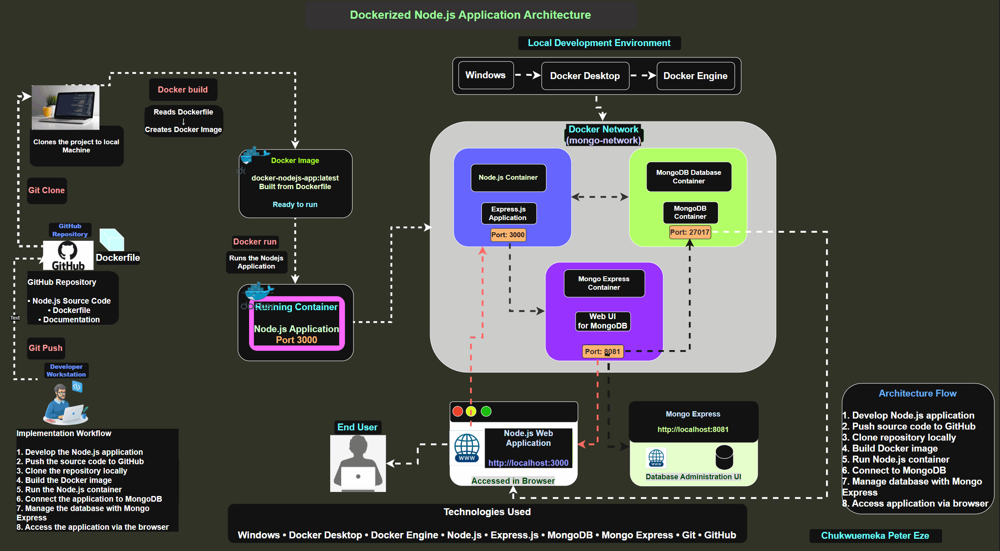
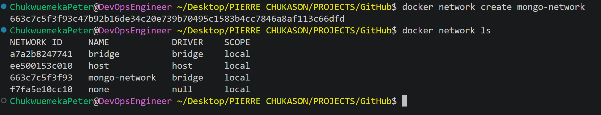
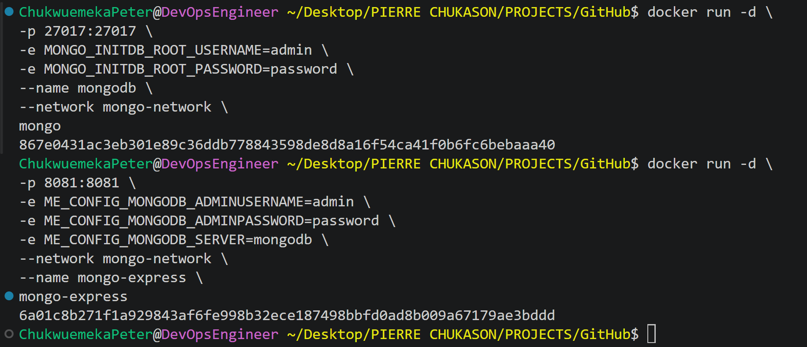
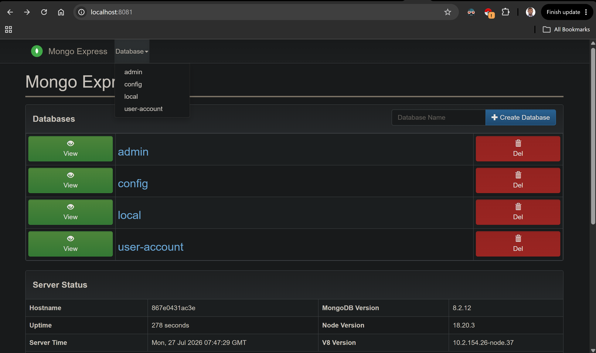
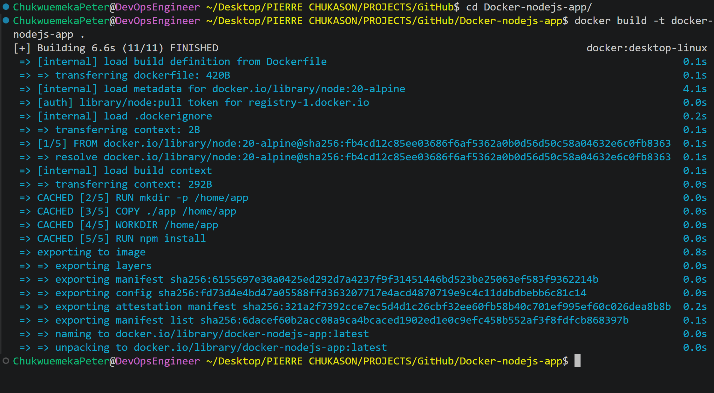
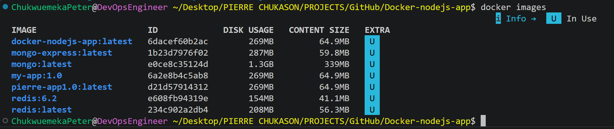
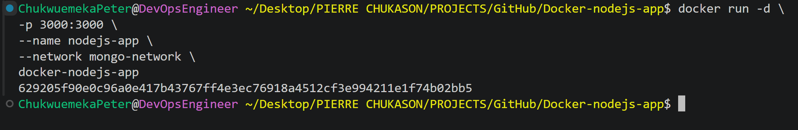
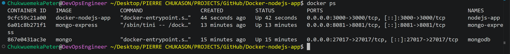
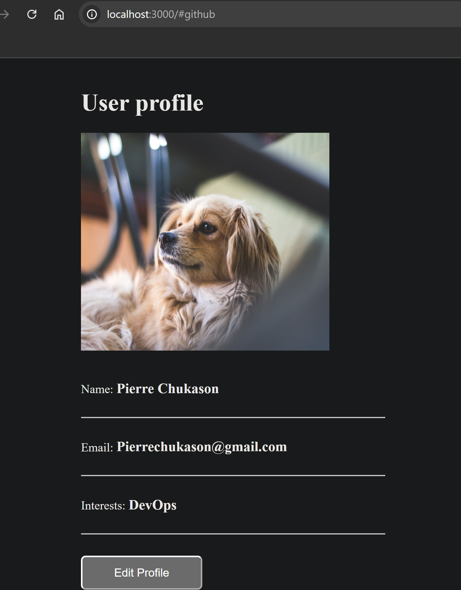

# Dockerizing a Node.js Application with Docker

<p align="center">


</p>

---

# Project Preview

> [!NOTE]
> This project demonstrates how I containerized a **Node.js application** using Docker, connected it to **MongoDB**, managed the database through **Mongo Express**, and documented the complete workflow from image creation to container management.

The repository includes comprehensive documentation covering:

- Building a custom Docker image from a Dockerfile
- Running and managing Docker containers
- Connecting the application to MongoDB
- Managing the database using Mongo Express
- Creating a custom Docker network for container communication
- Troubleshooting common Docker issues
- Key lessons learned throughout the implementation

---

# Table of Contents

- [Project Overview](#project-overview)
- [Project Objectives](#project-objectives)
- [Key Features](#key-features)
- [Application Architecture](#application-architecture)
- [Project Structure](#project-structure)
- [Technologies Used](#technologies-used)
- [Skills Demonstrated](#skills-demonstrated)
- [Prerequisites](#prerequisites)
- [Running the Project](#running-the-project)
- [Building the Docker Image](#building-the-docker-image)
- [Container Management](#container-management)
- [Troubleshooting](#troubleshooting)
- [Image Gallery](#image-gallery)
- [Challenges Encountered](#challenges-encountered)
- [Lessons Learned](#lessons-learned)
- [Future Improvements](#future-improvements)
- [Additional Documentation](#additional-documentation)
- [Project Summary](#project-summary)
- [Connect With Me](#connect-with-me)

---

# Project Overview

This project demonstrates the process of packaging a **Node.js application** into a Docker container and running it in a consistent, isolated environment on a local machine.

The application uses **MongoDB** as its database and **Mongo Express** as a web-based administration interface for managing stored data.

During this project, I gained practical experience with:

- Building Docker images from a Dockerfile
- Running and managing Docker containers
- Connecting containers using a custom Docker network
- Configuring MongoDB for persistent data storage
- Managing MongoDB with Mongo Express
- Inspecting container logs
- Accessing running containers for debugging
- Documenting the complete implementation workflow

Rather than focusing only on writing application code, this project emphasizes the practical skills required to package, deploy, manage, and troubleshoot containerized applications using Docker.

---

# Project Objectives

The objectives of this project were to:

- Understand Docker's architecture and core components.
- Learn the difference between Docker images and containers.
- Create a Dockerfile for a Node.js application.
- Build custom Docker images.
- Run containerized applications using Docker.
- Connect application and database containers through a custom Docker network.
- Configure MongoDB for persistent storage.
- Manage MongoDB using Mongo Express.
- Expose applications through Docker port mapping.
- Inspect running containers.
- Debug containers using logs and interactive shell access.
- Document the implementation process as a reusable engineering reference.

---

# Key Features

- Dockerized Node.js application
- Custom Docker image creation
- MongoDB database integration
- Mongo Express database management interface
- Custom Docker networking
- Container lifecycle management
- Docker CLI operations
- Interactive container debugging
- Technical documentation
- GitHub portfolio project

---

# Application Architecture

The following diagram illustrates the architecture of the Dockerized Node.js application and how the different components communicate with one another.

<p align="center">
  
</p>

*Figure 1: High-level architecture of the Dockerized Node.js application, showing the interaction between the web browser, Node.js application, MongoDB, Mongo Express, and the Docker network.*

---

## Architecture Overview

The application consists of four main components working together inside a Docker-based environment.

```text
                    +----------------------+
                    |      Web Browser     |
                    +----------+-----------+
                               |
                               | HTTP (Port 3000)
                               |
                    +----------v-----------+
                    |   Node.js Application |
                    |      (Express.js)     |
                    +----------+-----------+
                               |
                  Docker Network Communication
                               |
               +---------------+----------------+
               |                                |
     +---------v---------+            +---------v---------+
     |     MongoDB       |            |   Mongo Express   |
     |    Database       |            | Database Manager  |
     +-------------------+            +-------------------+
```

## How the Architecture Works

1. The user accesses the application through a web browser using **http://localhost:3000**.
2. The request is received by the **Node.js application** running inside a Docker container.
3. The application stores and retrieves data from the **MongoDB** container.
4. **Mongo Express** connects to MongoDB and provides a browser-based interface for viewing and managing the database.
5. A custom **Docker network** enables secure communication between the containers using their container names instead of IP addresses.

> [!TIP]
> This architecture follows Docker's best practice of running one primary service per container. Separating the application, database, and database administration interface makes the solution easier to maintain, troubleshoot, and extend in the future.

---

# Project Structure

```text
Docker-nodejs-app/
│
├── app/
│   ├── images/
│   ├── index.html
│   ├── package.json
│   ├── package-lock.json
│   └── server.js
│
├── docs/
│   ├── commands.md
│   ├── lessons-learned.md
│   ├── setup.md
│   ├── troubleshooting.md
│   └── video-script.md
│
├── images/
│   ├── architecture-diagram.png
│   └── ...
│
├── .gitignore
├── Dockerfile
├── LICENSE
└── README.md
```

---

# Technologies Used

| Technology | Purpose |
|------------|---------|
| Docker | Containerization platform |
| Docker Engine | Builds and runs containers |
| Docker CLI | Container management |
| Dockerfile | Defines the application image |
| Node.js | JavaScript runtime |
| Express.js | Backend web framework |
| MongoDB | Application database |
| Mongo Express | Web-based MongoDB administration |
| HTML | Frontend structure |
| CSS | Frontend styling |
| JavaScript | Frontend interactivity |
| Git | Version control |
| GitHub | Repository hosting and documentation |

---

# Key Skills Demonstrated

This project demonstrates practical experience with:

- Docker installation and configuration
- Building Docker images
- Creating Docker containers
- Writing Dockerfiles
- Container lifecycle management
- Docker networking
- MongoDB integration
- Mongo Express administration
- Port mapping
- Container inspection
- Docker logs
- Interactive container debugging
- Linux command-line operations
- Git version control
- GitHub documentation
- Technical documentation and engineering best practices

> [!NOTE]
> This project focuses on understanding the complete lifecycle of a Dockerized Node.js application, from image creation and container deployment to debugging, database integration, and documentation.

# Prerequisites

Before running this project, ensure the following software is installed on your local machine.

| Requirement | Purpose |
|-------------|---------|
| Docker Desktop | Build and run Docker containers |
| Docker Engine | Container runtime |
| Git | Clone the repository |
| Node.js & npm | Install and run the application locally |
| Web Browser | Access the application and Mongo Express |

> [!NOTE]
> This project was developed and tested on a local development environment using Docker Desktop. No cloud infrastructure or virtual machines were required.

---

# Clone the Repository

Clone the repository to your local machine.

```bash
git clone https://github.com/Chukwuemeka-Peter-Eze/Docker-nodejs-app.git
```

Navigate into the project directory.

```bash
cd Docker-nodejs-app
```

---

# Running the Project

The project uses three separate components:

- Node.js Application
- MongoDB Database
- Mongo Express

These components communicate through a custom Docker network.

---

## Step 1: Create a Docker Network

Create a custom Docker network so that the containers can communicate with each other.

```bash
docker network create mongo-network
```

> [!TIP]
> Docker networks allow containers to communicate using their container names instead of IP addresses.

### Image

<p align="center">

</p>

---

## Step 2: Start the MongoDB Container

```bash
docker run -d \
-p 27017:27017 \
-e MONGO_INITDB_ROOT_USERNAME=admin \
-e MONGO_INITDB_ROOT_PASSWORD=password \
--name mongodb \
--network mongo-network \
mongo
```

This command:

- Downloads the MongoDB image (if necessary)
- Creates a MongoDB container
- Exposes port **27017**
- Connects the container to the custom Docker network

### Image

<p align="center">

</p>

---

## Step 3: Start Mongo Express

```bash
docker run -d \
-p 8081:8081 \
-e ME_CONFIG_MONGODB_ADMINUSERNAME=admin \
-e ME_CONFIG_MONGODB_ADMINPASSWORD=password \
-e ME_CONFIG_MONGODB_SERVER=mongodb \
--network mongo-network \
--name mongo-express \
mongo-express
```

Mongo Express provides a browser-based interface for managing the MongoDB database.

Open:

```text
http://localhost:8081
```

Create:

- Database: **user-account**
- Collection: **users**

### Image

<p align="center">

</p>

---

## Step 4: Build the Docker Image

The Dockerfile packages the Node.js application into a reusable Docker image.

```bash
docker build -t docker-nodejs-app .
```

Docker performs the following tasks:

1. Reads the Dockerfile.
2. Downloads the base Node.js image.
3. Copies the application source code.
4. Installs project dependencies.
5. Creates image layers.
6. Builds the final Docker image.

### Image

<p align="center">

</p>

---

## Step 5: Verify the Image

List the available Docker images.

```bash
docker images
```

Verify that **docker-nodejs-app** appears in the list.

### Image

<p align="center">

</p>

---

## Step 6: Run the Node.js Container

Start the application container.

```bash
docker run -d \
-p 3000:3000 \
--name nodejs-app \
--network mongo-network \
docker-nodejs-app
```

This command:

- Creates a new container
- Maps port **3000**
- Starts the application in detached mode

### Image

<p align="center">

</p>

---

## Step 7: Verify the Running Container

Display all running containers.

```bash
docker ps
```

Confirm:

- MongoDB is running
- Mongo Express is running
- Node.js application is running

### Image

<p align="center">

</p>

---

## Step 8: Access the Application

Open your browser and navigate to:

```text
http://localhost:3000
```

If the application loads successfully, it confirms that:

- The Docker image was built successfully.
- The Node.js container is running.
- Port mapping is configured correctly.
- The application can communicate with MongoDB.

### Image

<p align="center">

</p>

> [!IMPORTANT]
> Data entered through the application is stored in MongoDB, allowing it to persist beyond individual application requests.

# Container Management

Once the application is running, Docker provides several commands for monitoring, managing, and troubleshooting containers.

---

## View Running Containers

Display all running containers.

```bash
docker ps
```

This command shows:

- Container ID
- Image
- Status
- Port mappings
- Container names

### Image

<p align="center">

</p>

---

## View Container Logs

Inspect the application's runtime logs.

```bash
docker logs nodejs-app
```

Logs are useful for identifying:

- Application startup messages
- Runtime errors
- Missing dependencies
- Connection issues
- Unexpected exceptions

> [!TIP]
> Checking container logs is often the first step when troubleshooting a containerized application.

---

## Access the Running Container

Open an interactive shell inside the running container.

```bash
docker exec -it nodejs-app sh
```

From inside the container, you can:

- Inspect application files
- Verify installed dependencies
- Explore the container file system
- Execute diagnostic commands

### Image

<p align="center">

</p>

---

## Stop the Container

Gracefully stop the running application.

```bash
docker stop nodejs-app
```
### Image

<p align="center">

</p>

---

## Restart the Container

Restart the application container.

```bash
docker restart nodejs-app
```

---

## Remove the Container

Delete the container without deleting the Docker image.

```bash
docker rm nodejs-app
```

---

## Remove the Docker Image

Delete the Docker image when it is no longer required.

```bash
docker rmi docker-nodejs-app
```

> [!NOTE]
> Removing a container does **not** remove the image. Images can be reused to create new containers at any time.

---

# Common Docker Commands

| Command | Purpose |
|----------|---------|
| `docker build` | Build a Docker image |
| `docker images` | List Docker images |
| `docker run` | Create and start a container |
| `docker ps` | Display running containers |
| `docker logs` | View container logs |
| `docker exec -it` | Access a running container |
| `docker stop` | Stop a container |
| `docker restart` | Restart a container |
| `docker rm` | Remove a container |
| `docker rmi` | Remove a Docker image |
| `docker network ls` | List Docker networks |

For a complete command reference, see **docs/commands.md**.

---

# Image Gallery

The following screenshots document the implementation process from start to finish.

| Step | Image |
|------|------------|
| Docker Installation | `docker-installation-verification.png` |
| Docker Network | `docker-network-created.png` |
| MongoDB Container | `mongodb-container-running.png` |
| Mongo Express | `mongo-express-dashboard.png` |
| Docker Build | `docker-build-success.png` |
| Docker Images | `docker-images-list.png` |
| Run Container | `nodejs-container-running.png` |
| Running Containers | `docker-ps-output.png` |
| Application Running | `application-running-browser.png` |
| Docker Stop | `docker-stop.png` |
| Docker Exec | `docker-exec-shell.png` |

> [!TIP]
> These images provide visual evidence of each major implementation step and help document the complete workflow.

---

# Challenges Encountered

During the project, several common Docker issues were encountered and resolved.

## Container Name Conflict

**Problem**

```
Conflict. The container name "/mongodb" is already in use.
```

**Cause**

A MongoDB container with the same name already existed.

**Resolution**

Either remove the existing container:

```bash
docker rm mongodb
```

or start the existing container:

```bash
docker start mongodb
```

---

## Port Already in Use

**Problem**

Docker could not bind the requested port.

**Resolution**

- Stop the conflicting application.
- Or use another available host port.

---

## Application Not Accessible

Possible causes included:

- Container not running
- Incorrect port mapping
- MongoDB not running
- Incorrect network configuration

The issue was resolved by verifying container status, reviewing logs, and confirming Docker network connectivity.

---

## Docker Image Build Errors

Build failures were resolved by:

- Reviewing Dockerfile instructions
- Correcting file paths
- Rebuilding the image

---

# Lessons Learned

This project reinforced several important containerization concepts.

- Docker images are reusable templates.
- Containers are running instances of images.
- Dockerfiles make deployments repeatable.
- Custom Docker networks simplify communication between containers.
- MongoDB integrates seamlessly with Docker containers.
- Docker logs are essential for troubleshooting.
- Interactive shell access simplifies debugging.
- Good documentation improves project maintainability and reproducibility.

> [!IMPORTANT]
> One of the biggest lessons from this project was understanding the complete lifecycle of a Dockerized application—from building an image to deploying, managing, debugging, and documenting the application.

---

# Future Improvements

Potential enhancements for future versions include:

- Implementing multi-stage Docker builds
- Running containers as a non-root user
- Adding Docker health checks
- Using environment variables through a `.env` file
- Publishing images to Docker Hub
- Integrating CI/CD with GitHub Actions
- Adding automated container image scanning
- Deploying the application to a cloud platform after local validation

---

# Additional Documentation

This repository includes detailed documentation covering the implementation, commands, troubleshooting process, lessons learned, and project walkthrough.

| Document | Description |
|----------|-------------|
| **docs/setup.md** | Step-by-step project setup guide |
| **docs/commands.md** | Docker command reference used throughout the project |
| **docs/troubleshooting.md** | Common issues encountered and their resolutions |
| **docs/lessons-learned.md** | Key concepts, engineering insights, and project reflections |
| **docs/video-script.md** | Presentation script for the project demonstration video |

> [!TIP]
> These documents provide additional context beyond the README and serve as a detailed engineering reference for the project.

---

# Project Summary

This project demonstrates the complete process of containerizing a **Node.js application** using Docker and integrating it with **MongoDB** for persistent data storage.

Throughout the implementation, I:

- Built a custom Docker image from a Dockerfile.
- Created and managed Docker containers.
- Configured a custom Docker network for container communication.
- Integrated MongoDB as the application's database.
- Used Mongo Express to manage database records through a web interface.
- Verified application functionality through a web browser.
- Inspected container logs for troubleshooting.
- Accessed running containers for debugging using an interactive shell.
- Documented the complete implementation process and lessons learned.

More than simply running an application inside a container, this project strengthened my understanding of Docker fundamentals, container lifecycle management, networking, debugging, and technical documentation—core skills used in modern software engineering and DevOps workflows.

---

# Repository Highlights

• Dockerized Node.js Application

• Custom Docker Image

• MongoDB Integration

• Mongo Express Administration

• Docker Networking

• Container Debugging

• Technical Documentation

• GitHub Portfolio Project

---

# Future Enhancements

This project provides a solid foundation for exploring more advanced containerization topics, including:

- Multi-stage Docker builds
- Docker volumes for persistent storage
- Docker image optimization
- Environment variable management with `.env` files
- Publishing images to Docker Hub
- CI/CD automation with GitHub Actions
- Container image security scanning
- Kubernetes orchestration
- Cloud deployment after local validation

---

# Connect With Me

If you have feedback, suggestions, or would like to connect, feel free to reach out.

**GitHub**

https://github.com/Chukwuemeka-Peter-Eze

**LinkedIn**

https://www.linkedin.com/in/chukwuemekapetereze/

**Notion**

https://lumpy-bubble-7b0.notion.site/Containers-with-Docker-3a546a96f97480a88041ff2ff82a6b5f

---

# Support

If you found this repository useful or learned something from it, consider giving it a ⭐.

It helps others discover the project and supports my journey as I continue building my DevOps and Cloud Engineering portfolio.