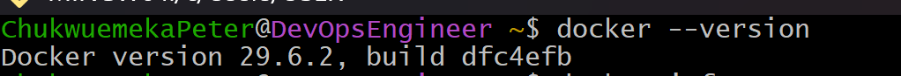
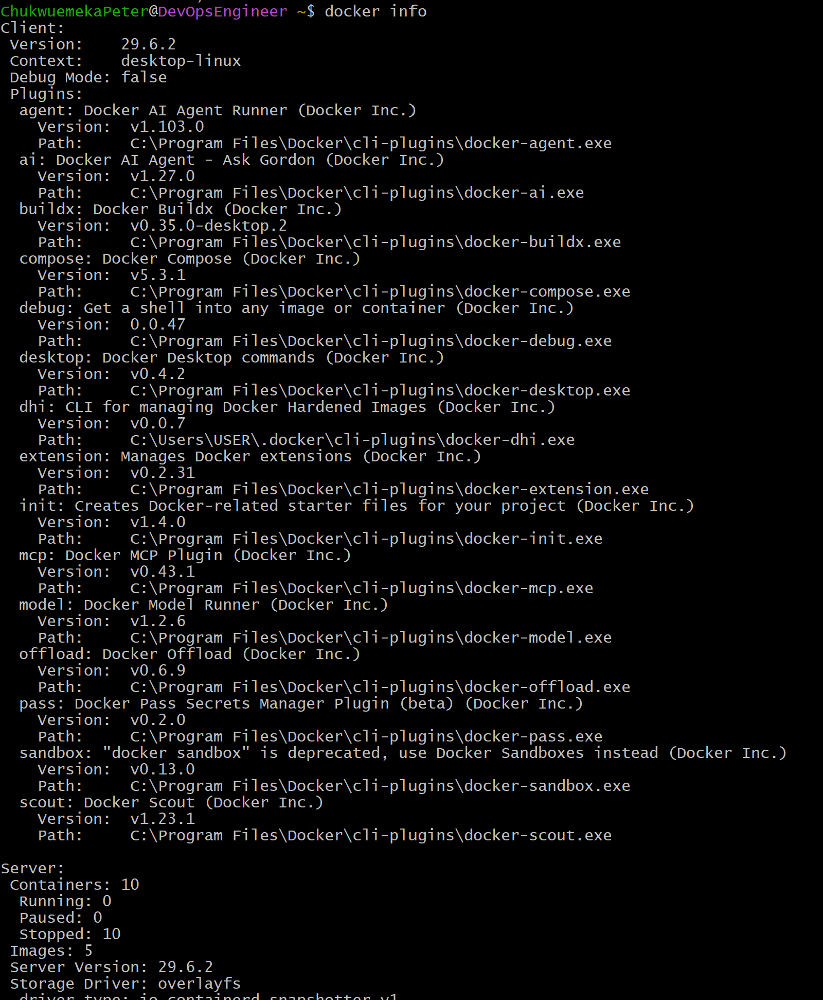

# Docker Node.js Application on AWS

<p align="center">


</p>

---

# Dockerizing a Full-Stack Node.js Application on AWS

This repository demonstrates how to package, deploy, and manage a full-stack **Node.js application** using **Docker** on an **Amazon EC2** instance.

The project focuses on the complete Docker workflow, including writing a Dockerfile, building Docker images, running and managing containers, configuring Docker networking, inspecting logs, debugging running containers, and verifying deployments.

Beyond demonstrating Docker commands, this repository documents the engineering process with architecture diagrams, implementation screenshots, troubleshooting notes, and operational best practices, making it suitable as a professional DevOps portfolio project.

---

> [!IMPORTANT]
> This repository focuses on **Docker fundamentals**. It demonstrates Docker images, containers, networking, container lifecycle management, and deployment on AWS EC2. Docker Compose is intentionally covered in a separate repository.

---

# Table of Contents

- [Project Overview](#project-overview)
- [Project Objectives](#project-objectives)
- [Key Skills Demonstrated](#key-skills-demonstrated)
- [Technologies Used](#technologies-used)
- [Application Architecture](#application-architecture)
- [Architecture Diagram](#architecture-diagram)
- [Project Structure](#project-structure)
- [Deployment Workflow](#deployment-workflow)
- [Learning Outcomes](#learning-outcomes)
- [Prerequisites](#prerequisites)
- [Environment Details](#environment-details)
- [Clone the Repository](#clone-the-repository)
- [Running the Application](#running-the-application)
- [Building a Standalone Docker Image](#building-a-standalone-docker-image)
- [Dockerfile Breakdown](#dockerfile-breakdown)
- [Docker Image Lifecycle](#docker-image-lifecycle)
- [Inspecting Container Logs](#inspecting-container-logs)
- [Accessing the Running Container](#accessing-the-running-container)
- [Managing the Container Lifecycle](#managing-the-container-lifecycle)
- [Common Docker Commands](#common-docker-commands)
- [Container Debugging Workflow](#container-debugging-workflow)
- [Docker Best Practices Applied](#docker-best-practices-applied)
- [Challenges Encountered](#challenges-encountered)
- [Lessons Learned](#lessons-learned)
- [Future Improvements](#future-improvements)
- [Additional Documentation](#additional-documentation)
- [References](#references)
- [Project Summary](#project-summary)
- [Connect With Me](#connect-with-me)

---

# Project Overview

This project demonstrates the end-to-end process of containerizing a full-stack Node.js application with Docker and deploying it on an Amazon EC2 instance.

The application consists of four primary components:

- Frontend built with HTML, CSS, and JavaScript
- Backend powered by Node.js and Express
- MongoDB database for persistent storage
- Mongo Express for database administration

During this project, the following tasks were completed:

- Installing Docker on Ubuntu Linux
- Creating a Dockerfile
- Building custom Docker images
- Running Docker containers
- Connecting containers through a custom Docker network
- Managing the complete container lifecycle
- Inspecting logs
- Accessing running containers
- Troubleshooting deployment issues
- Verifying the deployed application in a browser
- Documenting the implementation process

---

# Project Objectives

The primary objectives of this project were to:

- Understand Docker architecture and core concepts.
- Learn the difference between Docker images and containers.
- Create a production-ready Dockerfile.
- Build reusable Docker images.
- Deploy applications inside containers.
- Configure Docker networking.
- Manage running containers.
- Debug containerized applications.
- Understand container lifecycle management.
- Deploy Dockerized applications on AWS EC2.
- Produce professional engineering documentation.

---

# Key Skills Demonstrated

### Docker

- Docker Engine
- Docker Images
- Docker Containers
- Dockerfile
- Docker Build
- Docker CLI
- Docker Networks
- Port Mapping
- Image Tagging
- Container Lifecycle Management

### Cloud

- Amazon EC2
- Ubuntu Linux
- Linux Command Line
- SSH

### Application Development

- Node.js
- Express
- MongoDB
- Mongo Express

### DevOps

- Infrastructure Documentation
- Application Deployment
- Container Debugging
- Log Analysis
- Troubleshooting
- Repeatable Deployments

---

# Technologies Used

| Technology | Purpose |
|------------|---------|
| Docker | Containerization Platform |
| Dockerfile | Defines the application image |
| Docker CLI | Container management |
| Node.js | Backend runtime |
| Express | Backend web framework |
| MongoDB | Database |
| Mongo Express | Database administration |
| AWS EC2 | Cloud infrastructure |
| Ubuntu Linux | Operating system |
| Git | Version control |
| GitHub | Source code hosting |
| HTML | Frontend |
| CSS | Frontend styling |
| JavaScript | Client-side functionality |

---

> [!TIP]
> This project intentionally focuses on Docker fundamentals. Advanced orchestration technologies such as Docker Compose and Kubernetes are documented in separate repositories to keep each project focused on a specific learning objective.

---

# Application Architecture

This project uses a containerized architecture where each application component runs inside its own Docker container. The containers communicate through a custom Docker network, allowing the services to interact securely while remaining isolated from the host operating system.

The application consists of four primary components:

- **Frontend** - HTML, CSS, and JavaScript
- **Backend** - Node.js with Express
- **Database** - MongoDB
- **Database Administration** - Mongo Express

Docker provides the runtime environment for each component, ensuring that the application behaves consistently regardless of where it is deployed.

> [!IMPORTANT]
> One of Docker's greatest advantages is consistency. The same Docker image can be deployed on a developer's laptop, a virtual machine, or a cloud server without modifying the application.

---

# Architecture Diagram

The following diagram illustrates the overall deployment architecture.

<p align="center">
    
</p>

### Deployment Flow

The deployment process follows these steps:

1. A developer writes the Node.js application and Dockerfile.
2. The project is pushed to GitHub.
3. An Ubuntu-based Amazon EC2 instance serves as the deployment environment.
4. Docker Engine builds a reusable Docker image from the Dockerfile.
5. Docker creates containers from the image.
6. MongoDB stores application data.
7. Mongo Express provides a browser interface for database management.
8. The Node.js application communicates with MongoDB over the Docker network.
9. Users access the application through the EC2 public IP address.

---

# Application Components

| Component | Technology | Purpose |
|-----------|------------|---------|
| Frontend | HTML, CSS, JavaScript | User Interface |
| Backend | Node.js + Express | Business Logic |
| Database | MongoDB | Persistent Data Storage |
| Database Administration | Mongo Express | Database Management |
| Container Runtime | Docker Engine | Runs the application containers |
| Cloud Platform | Amazon EC2 | Hosts the deployment environment |

---

# Project Structure

The repository is organized into separate directories for application code, documentation, architecture assets, and implementation screenshots.

```text
Docker-nodejs-app/
│
├── app/
│   ├── images/
│   ├── index.html
│   ├── package.json
│   ├── package-lock.json
│   └── server.js
│
├── architecture/
│
├── docs/
│   ├── commands.md
│   ├── lessons-learned.md
│   ├── setup.md
│   ├── troubleshooting.md
│   └── video-script.md
│
├── images/
│   ├── architecture.gif
│   ├── browser-verification-of-the-application.png
│   ├── building-the-docker-image.png
│   ├── docker-installation-verification.png
│   ├── docker-installation-verification-details.png
│   ├── dockerfile-creation.png
│   ├── interactive-shell-access.png
│   ├── listing-docker-images.png
│   ├── listing-docker-images-2.png
│   ├── running-the-container.png
│   ├── running-container-verification.png
│   ├── verifying-running-containers.png
│   ├── verifying-running-container.png
│   ├── verifying-all-containers-running-and-stopped.png
│   ├── listing-stopped-containers.png
│   ├── stopping-the-container.png
│   └── starting-the-container.png
│
├── .gitignore
├── Dockerfile
├── README.md
└── LICENSE
```

> [!TIP]
> Separating source code, documentation, and images into dedicated folders keeps the repository organized and makes it easier to maintain as the project grows.

---

# Deployment Workflow

The following workflow summarizes how the application is built and deployed using Docker.

```text
Developer
      │
      ▼
Node.js Source Code
      │
      ▼
Dockerfile
      │
docker build
      │
      ▼
Docker Image
      │
docker run
      │
      ▼
Running Docker Container
      │
      ▼
Docker Network
      │
      ├──────────────┐
      ▼              ▼
MongoDB        Mongo Express
      │              │
      └──────┬───────┘
             ▼
     Node.js Application
             │
             ▼
      AWS EC2 Instance
             │
             ▼
        Web Browser
```

### Workflow Summary

The deployment follows these stages:

1. Clone the application source code.
2. Review the Dockerfile.
3. Build a Docker image.
4. Create Docker containers.
5. Connect containers through a Docker network.
6. Verify that the containers are running.
7. Access the application through the browser.
8. Monitor logs and troubleshoot issues when necessary.

> [!NOTE]
> Docker networking allows containers to communicate using container names instead of manually configured IP addresses, making deployments more reliable and easier to manage.

---

# Learning Outcomes

Completing this project provided practical experience with:

### Docker Fundamentals

- Building Docker images
- Understanding image layers
- Creating containers
- Managing container lifecycles
- Writing Dockerfiles
- Docker networking
- Port publishing
- Container inspection

### Linux & Cloud

- Working with Ubuntu Linux
- Managing an Amazon EC2 instance
- Connecting through SSH
- Verifying deployments

### Troubleshooting

- Viewing container logs
- Inspecting running containers
- Accessing containers with an interactive shell
- Identifying deployment issues
- Rebuilding Docker images

### Documentation

- Creating technical documentation
- Documenting deployment workflows
- Organizing project assets
- Capturing implementation screenshots
- Recording lessons learned

> [!IMPORTANT]
> This project focuses on mastering the complete Docker lifecycle—from writing a Dockerfile and building an image to deploying, managing, troubleshooting, and documenting a containerized application.

---

# Prerequisites

Before running this project, ensure the following tools and services are available.

| Requirement | Description |
|-------------|-------------|
| AWS Account | Used to provision the EC2 instance |
| Amazon EC2 | Ubuntu Linux virtual machine |
| Ubuntu Linux | Operating system used throughout this implementation |
| Docker Engine | Required to build and run containers |
| Git | Used to clone the repository |
| Node.js | Required for running the application |
| SSH Client | Used to connect to the EC2 instance |
| Web Browser | Used to verify the deployed application |

> [!IMPORTANT]
> This project was implemented on an **Ubuntu Amazon EC2 instance** using **Docker Engine**. The same workflow can also be reproduced on any Linux machine with Docker installed.

---

# Environment Details

| Component | Value |
|-----------|-------|
| Cloud Provider | Amazon Web Services (AWS) |
| Compute Service | Amazon EC2 |
| Operating System | Ubuntu Linux |
| Container Runtime | Docker Engine |
| Programming Language | JavaScript |
| Runtime | Node.js |
| Database | MongoDB |
| Database Administration | Mongo Express |
| Version Control | Git |
| Repository Hosting | GitHub |

---

# Clone the Repository

Clone the repository onto your EC2 instance or local machine.

```bash
git clone https://github.com/Chukwuemeka-Peter-Eze/Docker-nodejs-app.git
```

Navigate into the project directory.

```bash
cd Docker-nodejs-app
```

---

# Running the Application

This project demonstrates how to deploy a containerized Node.js application by running each service in its own Docker container while connecting them through a custom Docker network.

The deployment workflow consists of the following stages:

1. Create a Docker network.
2. Start the MongoDB container.
3. Start the Mongo Express container.
4. Build the Docker image.
5. Start the Node.js application container.
6. Verify that all containers are running.
7. Create the database and collection.
8. Access the application in the browser.

---

# Step 1: Create a Docker Network

Create a dedicated Docker network that allows the application containers to communicate securely.

```bash
docker network create mongo-network
```

> [!NOTE]
> Docker networks allow containers to communicate using container names instead of IP addresses.

---

# Step 2: Start the MongoDB Container

Run MongoDB inside a Docker container.

```bash
docker run -d \
-p 27017:27017 \
-e MONGO_INITDB_ROOT_USERNAME=admin \
-e MONGO_INITDB_ROOT_PASSWORD=password \
--name mongodb \
--network mongo-network \
mongo
```

MongoDB now serves as the application's persistent database.

---

# Step 3: Start Mongo Express

Run Mongo Express and connect it to MongoDB.

```bash
docker run -d \
-p 8081:8081 \
-e ME_CONFIG_MONGODB_ADMINUSERNAME=admin \
-e ME_CONFIG_MONGODB_ADMINPASSWORD=password \
-e ME_CONFIG_MONGODB_SERVER=mongodb \
--network mongo-network \
--name mongo-express \
mongo-express
```

Mongo Express provides a web interface for managing MongoDB.

---

# Step 4: Verify Docker Installation

Before building the application image, verify that Docker is installed correctly.

```bash
docker --version
docker info
```

The following screenshot confirms that Docker is installed successfully.

<p align="center">

</p>

The detailed Docker information is shown below.

<p align="center">

</p>

---

# Step 5: Review the Dockerfile

The application is packaged using a Dockerfile located in the project root.

The screenshot below shows the Dockerfile used in this project.

<p align="center">

</p>

> [!TIP]
> A Dockerfile defines how Docker builds an image, including the base image, working directory, dependencies, exposed ports, and startup command.

---

# Step 6: Build the Docker Image

Build the Docker image.

```bash
docker build -t docker-nodejs-app .
```

The following screenshot shows a successful image build.

<p align="center">

</p>

---

# Step 7: Verify the Docker Image

Verify that the image has been created successfully.

```bash
docker images
```

Docker displays the available images.

<p align="center">

</p>

If multiple images exist, the output may resemble the following.

<p align="center">

</p>

---

# Step 8: Start the Application Container

Run the Node.js application.

```bash
docker run -d \
-p 3000:3000 \
--name nodejs-app \
docker-nodejs-app
```

The screenshot below shows the application container being started.

<p align="center">

</p>

---

# Step 9: Verify Running Containers

Display all currently running containers.

```bash
docker ps
```

The following screenshot confirms that the application containers are running.

<p align="center">

</p>

Additional verification.

<p align="center">

</p>

---

# Step 10: Display All Containers

Display both running and stopped containers.

```bash
docker ps -a
```

<p align="center">

</p>

---

# Step 11: Configure MongoDB

Open Mongo Express.

```text
http://localhost:8081
```

Create the following:

**Database**

```text
user-account
```

**Collection**

```text
users
```

---

# Step 12: Run the Node.js Application

If running the application directly from the project instead of inside Docker:

```bash
cd app

npm install

node server.js
```

---

# Step 13: Verify the Deployment

Open the application.

```text
http://localhost:3000
```

The following screenshot confirms the application is running successfully.

<p align="center">

</p>

> [!IMPORTANT]
> Successfully accessing the application confirms that the Docker image, Docker containers, networking configuration, MongoDB connection, and Node.js application are all functioning correctly.

---

# Building a Standalone Docker Image

One of Docker's greatest strengths is its ability to package an application together with its runtime environment and dependencies into a portable, reusable image.

For this project, the Node.js application is packaged into a custom Docker image using the project's **Dockerfile**. Once the image has been built, it can be used to create identical containers across development, testing, and production environments.

> [!IMPORTANT]
> A **Docker image** is a read-only template, while a **Docker container** is a running instance of that image.

---

# Dockerfile Breakdown

The Dockerfile defines every step Docker performs while building the application image.

The build process follows this sequence:

```text
Dockerfile
      │
      ▼
Read Instructions
      │
      ▼
Pull Node.js Base Image
      │
      ▼
Create Working Directory
      │
      ▼
Copy Application Files
      │
      ▼
Install Dependencies
      │
      ▼
Expose Port 3000
      │
      ▼
Define Startup Command
      │
      ▼
Create Docker Image
```

The Dockerfile in this project performs the following tasks:

- Uses an official Node.js base image.
- Creates the application working directory.
- Copies the application source code.
- Installs project dependencies.
- Exposes port **3000**.
- Defines the startup command.

The screenshot below shows the Dockerfile used in this project.

<p align="center">

</p>

---

# Docker Image Build Process

Build the application image.

```bash
docker build -t docker-nodejs-app .
```

Docker performs several operations automatically:

1. Reads the Dockerfile.
2. Downloads the required base image.
3. Copies application files.
4. Installs dependencies.
5. Creates image layers.
6. Produces the final Docker image.

The following screenshot shows a successful build.

<p align="center">

</p>

---

# Verify the Docker Image

Verify that Docker successfully created the image.

```bash
docker images
```

Expected output includes:

- Repository
- Tag
- Image ID
- Creation Date
- Image Size

<p align="center">

</p>

If additional images exist locally, your output may resemble:

<p align="center">

</p>

---

# Create and Run the Container

Create a running container from the Docker image.

```bash
docker run -d \
-p 3000:3000 \
--name nodejs-app \
docker-nodejs-app
```

Command explanation:

| Option | Description |
|---------|-------------|
| `-d` | Run in detached mode |
| `-p` | Publish the application port |
| `--name` | Assign a readable container name |
| `docker-nodejs-app` | Docker image used to create the container |

The screenshot below shows the application container starting successfully.

<p align="center">

</p>

---

# Verify Running Containers

Display all running containers.

```bash
docker ps
```

The following screenshot confirms that the required containers are running.

<p align="center">

</p>

Additional verification:

<p align="center">

</p>

---

# Docker Image Lifecycle

Understanding the Docker image lifecycle helps explain how source code becomes a running application.

```text
Application Source Code
            │
            ▼
        Dockerfile
            │
            ▼
      docker build
            │
            ▼
      Docker Image
            │
            ▼
       docker run
            │
            ▼
    Running Container
            │
            ▼
docker stop / start
            │
            ▼
 docker rm (optional)
```

> [!NOTE]
> Images remain unchanged after they are built. Containers can be started, stopped, restarted, and removed without modifying the underlying image.

---

# Inspecting Container Logs

When troubleshooting containerized applications, logs are typically the first place to investigate.

Display application logs:

```bash
docker logs nodejs-app
```

Container logs commonly include:

- Startup messages
- Application errors
- Dependency issues
- Database connection failures
- Runtime exceptions

> [!TIP]
> Before rebuilding an image, always inspect the container logs. Many deployment issues can be resolved without rebuilding the image.

---

# Accessing the Running Container

Open an interactive shell inside the running container.

```bash
docker exec -it nodejs-app sh
```

Interactive shell access allows you to:

- Browse application files.
- Verify installed packages.
- Inspect environment variables.
- Execute Linux commands.
- Diagnose runtime issues.

The screenshot below demonstrates interactive shell access.

<p align="center">

</p>

---

# Managing the Container Lifecycle

Docker containers can be started, stopped, restarted, and removed independently of the Docker image.

## Stop the Container

```bash
docker stop nodejs-app
```

<p align="center">

</p>

---

## Start the Container

```bash
docker start nodejs-app
```

<p align="center">

</p>

---

## Restart the Container

```bash
docker restart nodejs-app
```

Restarting stops the running container before immediately starting it again.

---

## Display All Containers

```bash
docker ps -a
```

<p align="center">

</p>

---

## Display Stopped Containers

```bash
docker ps -f "status=exited"
```

<p align="center">

</p>

---

## Remove a Container

```bash
docker rm nodejs-app
```

Removes the container while preserving the Docker image.

---

## Remove the Docker Image

```bash
docker rmi docker-nodejs-app
```

> [!WARNING]
> Docker does not allow an image to be removed while containers created from that image still exist. Remove the containers first, or use the `-f` flag if appropriate.

---

# Common Docker Commands

| Command | Purpose |
|---------|---------|
| `docker build` | Build an image |
| `docker images` | List Docker images |
| `docker run` | Create and start a container |
| `docker ps` | List running containers |
| `docker ps -a` | List all containers |
| `docker logs` | View container logs |
| `docker exec -it` | Open an interactive shell |
| `docker stop` | Stop a container |
| `docker start` | Start a stopped container |
| `docker restart` | Restart a container |
| `docker rm` | Remove a container |
| `docker rmi` | Remove a Docker image |

---

# Container Debugging Workflow

```text
Application Not Responding
            │
            ▼
Check Running Containers
      docker ps
            │
            ▼
Inspect Container Logs
     docker logs
            │
            ▼
Access the Container
 docker exec -it
            │
            ▼
Verify Configuration
            │
            ▼
Identify the Root Cause
            │
            ▼
Apply the Fix
            │
            ▼
Rebuild the Image (if required)
            │
            ▼
Redeploy the Container
```

> [!IMPORTANT]
> A structured troubleshooting process helps reduce downtime and makes diagnosing deployment issues significantly more efficient.

---

# Docker Best Practices Applied

The following Docker best practices were implemented throughout this project:

- Used an official Node.js base image.
- Created a dedicated Dockerfile for the application.
- Built reusable Docker images.
- Assigned meaningful names to containers and networks.
- Used a custom Docker network for container communication.
- Published only the required application ports.
- Verified image creation before deployment.
- Verified running containers after deployment.
- Used Docker logs for troubleshooting.
- Used `docker exec` for container inspection.
- Maintained a repeatable deployment workflow.
- Documented every major implementation step.

> [!TIP]
> Following Docker best practices improves consistency, simplifies troubleshooting, and makes deployments easier to reproduce across different environments.

---

# Screenshot Gallery

The repository contains screenshots documenting the complete implementation process.

| Screenshot | Description |
|------------|-------------|
| docker-installation-verification.png | Verifying Docker installation |
| docker-installation-verification-details.png | Detailed Docker environment information |
| dockerfile-creation.png | Dockerfile used to build the application |
| building-the-docker-image.png | Building the Docker image |
| listing-docker-images.png | Listing Docker images |
| listing-docker-images-2.png | Additional Docker images |
| running-the-container.png | Starting the application container |
| verifying-running-containers.png | Displaying running containers |
| verifying-running-container.png | Additional container verification |
| verifying-all-containers-running-and-stopped.png | Displaying all containers |
| browser-verification-of-the-application.png | Successfully running application |
| interactive-shell-access.png | Accessing a running container |
| stopping-the-container.png | Stopping a container |
| starting-the-container.png | Starting a stopped container |
| listing-stopped-containers.png | Displaying exited containers |

---

# Challenges Encountered

## Container Failed to Start

Possible causes:

- Incorrect startup command
- Missing dependencies
- Incorrect working directory

Resolution:

- Reviewed the Dockerfile.
- Inspected container logs.
- Rebuilt the Docker image.

---

## Port Already in Use

Possible causes:

- Another application was already using the selected port.

Resolution:

- Identified the conflicting process.
- Stopped the existing service.
- Restarted the container.

---

## Image Build Errors

Possible causes:

- Missing project files
- Dockerfile configuration errors
- Dependency installation failures

Resolution:

- Reviewed the build output.
- Corrected Dockerfile instructions.
- Rebuilt the Docker image.

---

## Application Not Accessible

Possible causes:

- Incorrect port mapping
- Container not running
- MongoDB connection issues
- AWS Security Group configuration

Resolution:

- Verified port mappings.
- Checked running containers.
- Inspected logs.
- Confirmed EC2 inbound rules.
- Verified MongoDB connectivity.

> [!NOTE]
> Most deployment issues were resolved by following a structured troubleshooting workflow using `docker ps`, `docker logs`, and `docker exec`.

---

# Lessons Learned

Completing this project reinforced several important DevOps concepts:

- Docker images provide consistent deployment artifacts.
- Containers isolate applications from the host operating system.
- Dockerfiles make deployments repeatable.
- Docker networking enables reliable communication between containers.
- Logging is essential for troubleshooting.
- Interactive shell access simplifies debugging.
- Image layering improves build efficiency.
- Infrastructure documentation improves reproducibility.
- AWS EC2 provides a reliable environment for containerized workloads.

---

# Future Improvements

Potential enhancements include:

- Implementing multi-stage Docker builds.
- Running containers as a non-root user.
- Adding Docker health checks.
- Integrating automated image scanning.
- Publishing Docker images to a container registry.
- Managing configuration through environment variables.
- Adding automated testing before image creation.
- Deploying the application with Kubernetes in a future project.

> [!IMPORTANT]
> Docker Compose and Kubernetes are intentionally documented in separate repositories so that each repository focuses on a single technology and learning objective.

---

# Additional Documentation

Additional project documentation is available in the `docs` directory.

| Document | Description |
|----------|-------------|
| docs/setup.md | Environment setup instructions |
| docs/commands.md | Extended Docker command reference |
| docs/troubleshooting.md | Troubleshooting guide |
| docs/lessons-learned.md | Detailed lessons learned |
| docs/video-script.md | Project walkthrough script |
| docker_commands.md | Docker CLI quick-reference |

---

# References

This project was implemented using the following official resources:

- Docker Official Documentation
- Docker CLI Reference
- Dockerfile Best Practices
- MongoDB Documentation
- Mongo Express Documentation
- Node.js Documentation
- Express Documentation
- AWS EC2 Documentation

---

# Project Summary

This project demonstrates the complete lifecycle of containerizing and deploying a full-stack Node.js application using Docker on an Amazon EC2 instance.

The implementation included:

- Installing Docker on Ubuntu Linux.
- Building a custom Docker image.
- Running MongoDB and Mongo Express in Docker containers.
- Connecting containers using a Docker network.
- Deploying the Node.js application.
- Verifying successful deployment.
- Inspecting logs.
- Managing the container lifecycle.
- Troubleshooting deployment issues.
- Documenting the complete engineering workflow.

Beyond simply running an application inside Docker, this project demonstrates practical experience with containerization, infrastructure documentation, Linux administration, and cloud-based deployments.

---

# Connect With Me

If you found this project helpful or would like to discuss Docker, DevOps, Cloud Engineering, or Infrastructure Automation, feel free to connect.

- **GitHub:** https://github.com/Chukwuemeka-Peter-Eze
- **LinkedIn:** https://www.linkedin.com/in/chukwuemekapetereze/
- **Notion:** https://lumpy-bubble-7b0.notion.site/Containers-with-Docker-3a546a96f97480a88041ff2ff82a6b5f

---

⭐ **If you found this repository useful, consider giving it a star to support the project.**
